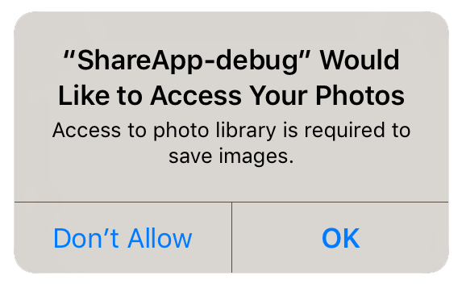

If you are going to be using the "true heading" on iOS then you are going to be accessing the user's location.

When you are going to be accessing the user's location you must check that your application has been allowed access. To this end the extension provides several helpers to check and request access to the location services.

:::info
On iOS you will only be able to display the authorisation request dialog once! Hence it is very important that you inform your users why they should grant authorisation before requesting authorisation. To request authorisation you call `requestAuthorisation()`. This function will trigger the native dialog asking the user for authorisation.
:::

You can check if you currently have permission using the `hasAuthorisation()` function:

```actionscript
if (Compass.service.hasAuthorisation())
{
	// Application has permission to access trueHeading
}
```

If this returns false you should expect a `-1` value for true heading.

To request authorisation at runtime, you call the `requestAuthorisation()` function. 
The following code will work across both platforms:

```actionscript
switch (Compass.service.authorisationStatus())
{
	case AuthorisationStatus.ALWAYS:
	case AuthorisationStatus.IN_USE:
		trace( "User allowed access: " + Compass.service.authorisationStatus() );
		break;
	
	case AuthorisationStatus.NOT_DETERMINED:
	case AuthorisationStatus.SHOULD_EXPLAIN:
		Compass.service.addEventListener( AuthorisationEvent.CHANGED, authorisationChangedHandler );
		Compass.service.requestAuthorisation( AuthorisationStatus.ALWAYS );
		break;
	
	case AuthorisationStatus.RESTRICTED:
	case AuthorisationStatus.DENIED:
	case AuthorisationStatus.UNKNOWN:
		trace( "User denied access" );
		break;
}

function authorisationChangedHandler( event:AuthorisationEvent ):void
{
	//
}
```


## Usage Description

You can customise the usage description messages as you see fit to suit your application. These messages are displayed in the main body area of the iOS authorisation dialog with the title and buttons being standard (and not customisable).

The image below is an example of the authorisation dialog. The content *"Access to photo library is required to save images."* is the usage description message you can set.



You set these values through adding the usage description keys to your info additions or simply by setting up your configuration options in your `apm` project. 


