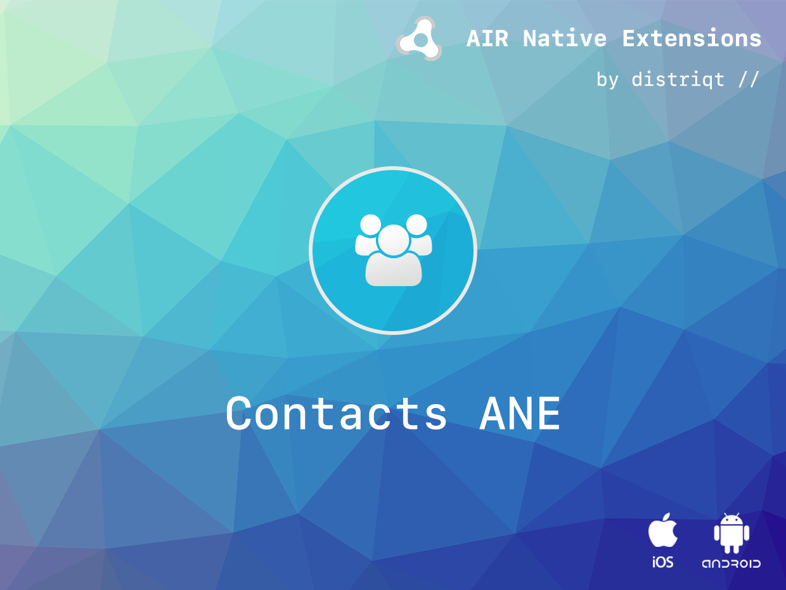
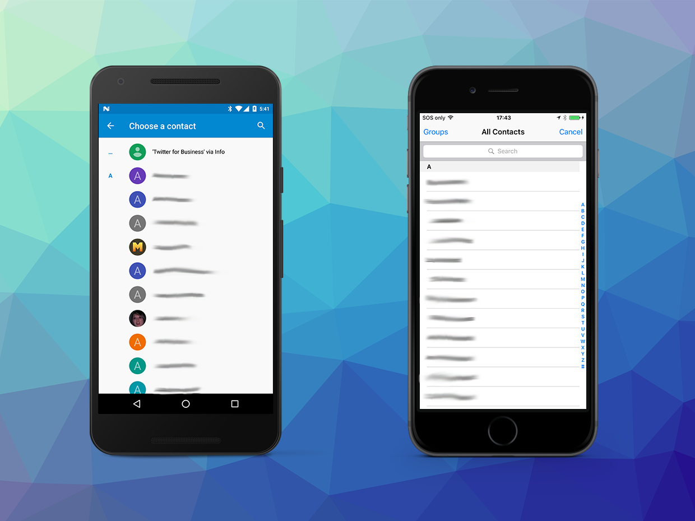

# Contacts

The [Contacts](http://airnativeextensions.com/extension/com.distriqt.Contacts) gives you the ability to access the user's contact list. You can retrieve details on a particular contact, get a list of the entire contact list or display a native UI picker to get a user selection. Included in this functionality is all the ability to request the correct iOS permissions.

The simple API allows you to quickly integrate contact access in your AIR application in just a few lines of code. Identical code base can be used across all platforms allowing you to concentrate on your application and not device specifics.

We provide complete guides to get you up and running with asset selection quickly and easily.

### Features

- Retrieve the entire contact list as JSON;
- Save all available contact images to an application directory;
- Display the native contact picker;
- Access latest details of a contact including: IM details, Social networks, websites and contact events (birthday)

As with all our extensions you get access to a year of support and updates as we are continually improving and updating the extensions for OS updates and feature requests.

## Documentation

The [documentation site](https://docs.airnativeextensions.com/docs/contacts) forms the best source of detailed documentation for the extension along with the [asdocs](http://docs.airnativeextensions.com/asdocs/contacts).

More information here:

[com.distriqt.Contacts](https://airnativeextensions.com/extension/com.distriqt.Contacts)

## License

You can purchase a license for using this extension:

[airnativeextensions.com](https://airnativeextensions.com/)

distriqt retains all copyright.

