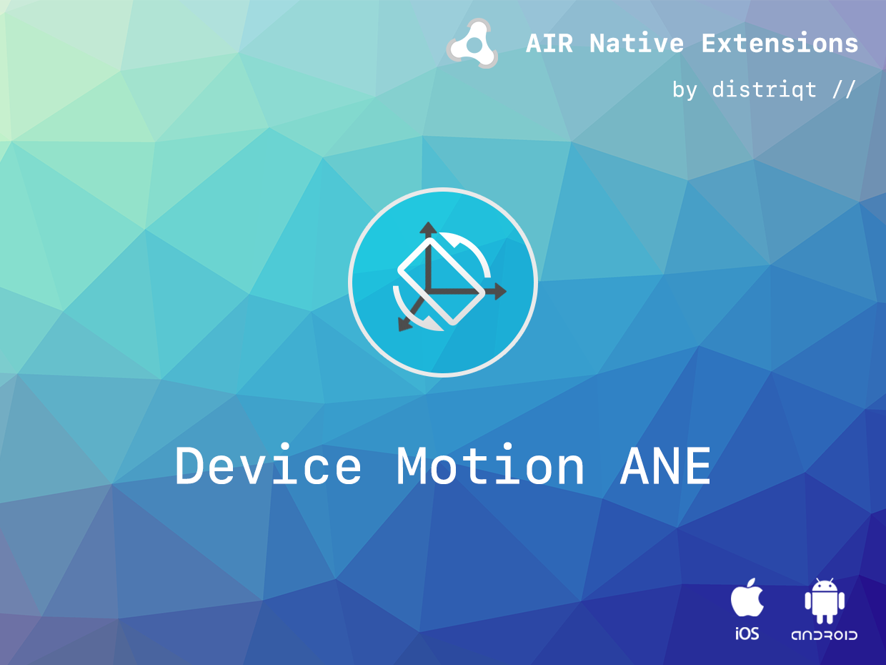
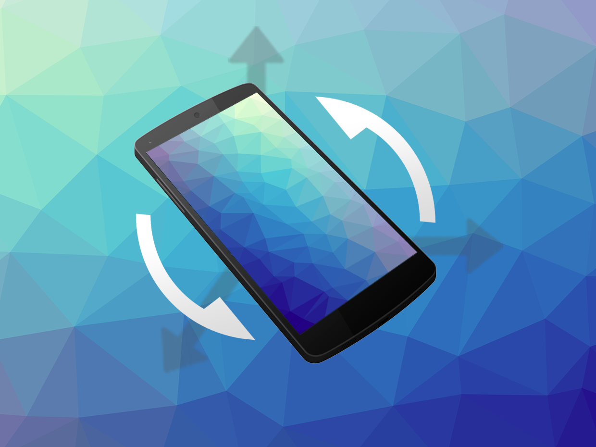

# Device Motion

[Device motion](https://airnativeextensions.com/extension/com.distriqt.DeviceMotion) is an extension that you can use for getting updates about the position or more precisely the orientation of the device in 3D space.

The extension calculates and reports angles by use of various sensor fusion algorithms
which combine the available sensors into orientation and rotational information.
The quality of this information depends mainly on the hardware contained in the current device.
Generally we require 3 sensors for these calculations: an accelerometer, a magnetometer and a gyroscope.


The extension works by registering for notifications of device motion. When you register for updates you specify a series of options about the updates which the extension use to determine the algorithm that is used to calculate the device orientation, and also the information format that is returned.

### Features

- Provides access to the orientation of the device in 3D space
- Uses sensor fusion algorithms to combine information from the accelerometer, magnetometer and gyroscope
- Works across iOS and Android with the same code
- Sample project code and ASDocs reference

As with all our extensions you get access to a year of support and updates as we are continually improving and updating the extensions for OS updates and feature requests.

## Documentation

The [documentation site](https://docs.airnativeextensions.com/docs/devicemotion) forms the best source of detailed documentation for the extension along with the [asdocs](https://docs.airnativeextensions.com/asdocs/devicemotion).

Quick Example:

```actionscript
DeviceMotion.service.addEventListener( DeviceMotionEvent.UPDATE_QUATERNION, deviceMotion_updateHandler );

var options:DeviceMotionOptions = new DeviceMotionOptions();
options.rate 		= SensorRate.SENSOR_DELAY_NORMAL;
options.algorithm 	= DeviceMotionOptions.ALGORITHM_NATIVE;
options.format 		= DeviceMotionOptions.FORMAT_QUATERNION;

DeviceMotion.service.register( options );

private function deviceMotion_updateHandler( event:DeviceMotionEvent ):void
{
	var q:Quaternion = new Quaternion( event.values[1], event.values[2], event.values[3], event.values[0] );
}
```

More information here:

[com.distriqt.DeviceMotion](https://airnativeextensions.com/extension/com.distriqt.DeviceMotion)

## License

You can purchase a license for using this extension:

- [airnativeextensions.com](https://airnativeextensions.com/)

distriqt retains all copyright.


