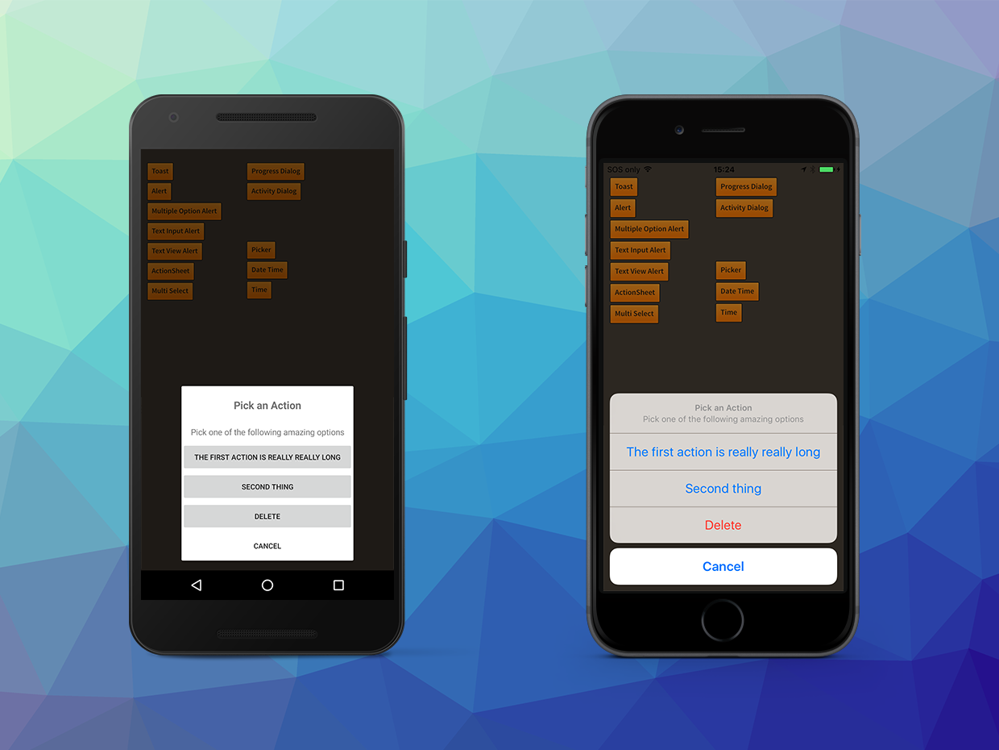

Action sheets display a set of buttons representing several alternative choices to complete a 
task initiated by the user. It allows your application to get a user to quickly select from a 
list of actions or to confirm / cancel an action. 

The list is presented from the bottom of the screen.

An Action Sheet is created by using an `ActionSheetBuilder`.

```actionscript
var actionSheet:DialogView = Dialog.service.create( 
		new ActionSheetBuilder()
			.setTitle( "Pick an Action" )
			.setMessage( "Pick one of the following amazing options" )
			.addAction( "The first action" )
			.addAction( "Second thing" )
			.addAction( "Cancel", DialogAction.STYLE_CANCEL )
			.build()
		);
	
actionSheet.addEventListener( DialogViewEvent.CLOSED, actionSheet_closedHandler );
actionSheet.show();

...

private function actionSheet_closedHandler( event:DialogViewEvent ):void
{
	trace( "actionSheet closed " + event.index );
	var actionSheet:DialogView = DialogView(event.currentTarget);
	actionSheet.removeEventListener( DialogViewEvent.CLOSED, actionSheet_closedHandler );			
	actionSheet.dispose();
}
```