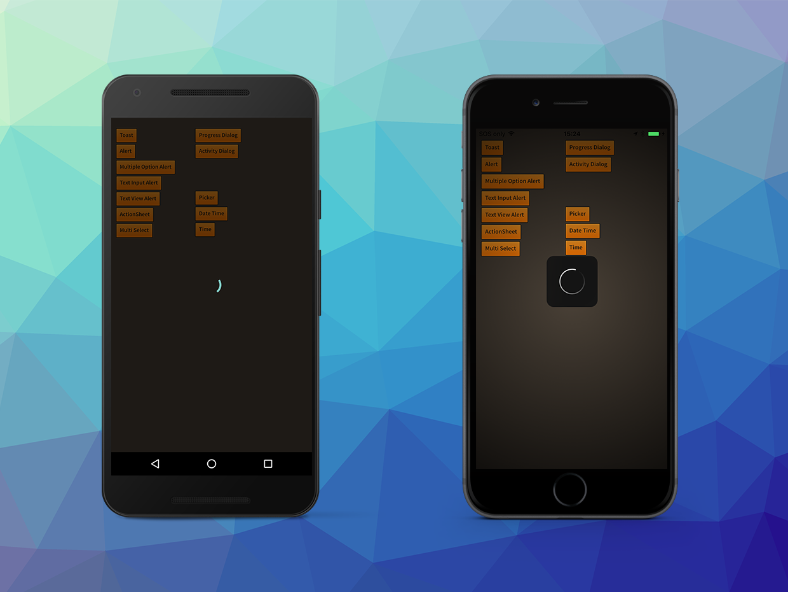

The Activity dialog can be used to indicate some activity or process is occurring to the user. 
It is a very simple activity indicator which can be used in cases where the Progress Dialog is 
too detailed. Generally it just displays a native activity indicator in the form of a circular 
spinner.

An activity dialog is created by using an `ActivityBuilder`.

```actionscript
var activityDialog:DialogView = Dialog.service.create( 
		new ActivityBuilder()
			.setTheme( new DialogTheme( DialogTheme.DEVICE_DEFAULT_DARK ))
			.build()
		);
activityDialog.show();
```

To remove the activity dialog simply call `dismiss()` as below:

```actionscript
activityDialog.dismiss();
```


### iOS Additions

iOS allows some minor additions to the display of the activity dialog. You can either use the native iOS activity indicator which is a spinner type animation with marks around a circle or an annular style more closely resembling the more modern look of the Android activity indicator. You specify the difference using the `setStyle` function on the builder, using either `DialogType.STYLE_ANNULAR` or `DialogType.STYLE_SPINNER`

On iOS you can also add some text below the animation by using the `setTitle` function. For example:

```actionscript
new ActivityBuilder()
	.setTheme( new DialogTheme( DialogTheme.DEVICE_DEFAULT_DARK ))
	.setStyle( DialogType.STYLE_SPINNER )
	.setTitle( "Test Title" )
	.build()
```

| DialogType.STYLE_ANNULAR | DialogType.STYLE_SPINNER | 
| --- | --- | 
| [images/ios_activity_annular.png]] ](-[[images/ios_activity_spinner.png) |


