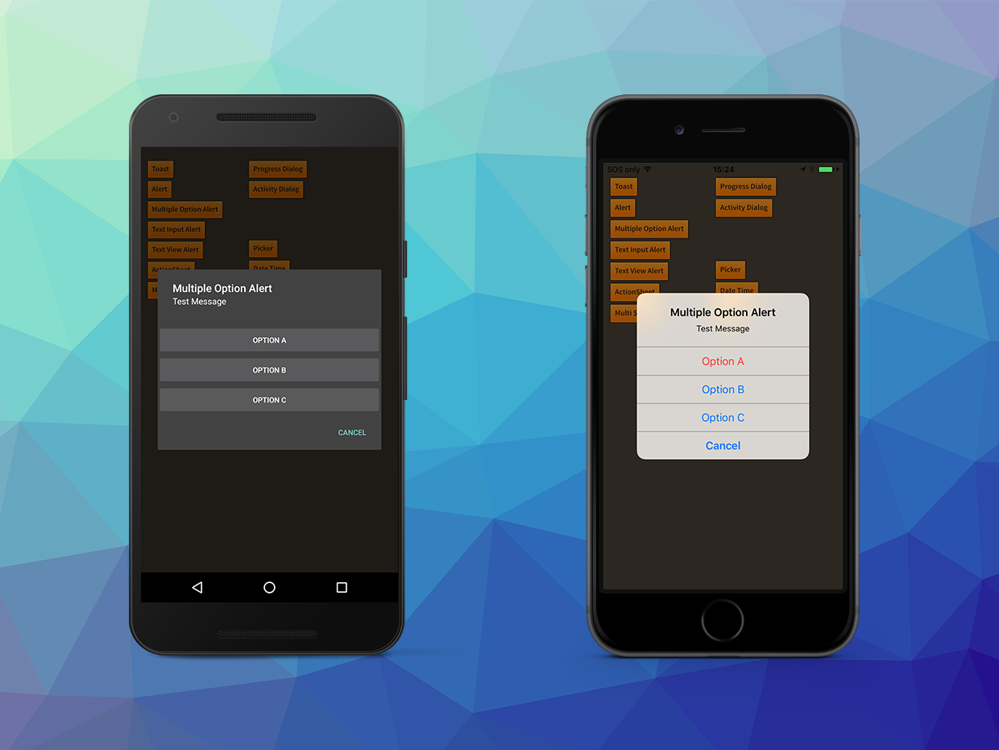
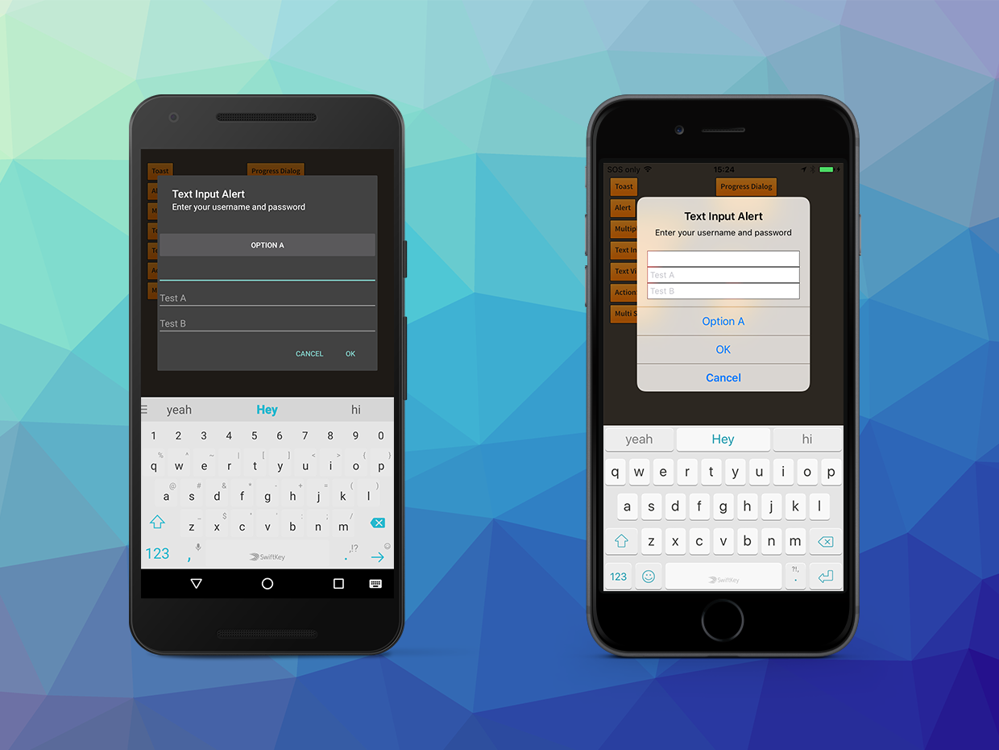

The alert dialog is a modal dialog that can display a title, a message and a series of actions.
It is the most common dialog that you will use to inform the user of critical actions and to 
get user feedback.

Alerts are created using an `AlertBuilder`.

```actionscript
var alert:DialogView = Dialog.service.create( 
			new AlertBuilder()
				.setTitle( "Alert" )
				.setMessage( "Test Message" )
				.addOption( "OK", DialogAction.STYLE_POSITIVE, 0 )
				.build()
			);
alert.addEventListener( DialogViewEvent.CLOSED, alert_closedHandler );
alert.show();

...

private function alert_closedHandler( event:DialogViewEvent ):void
{
	var alert:DialogView = DialogView(event.currentTarget);
	alert.removeEventListener( DialogViewEvent.CLOSED, alert_closedHandler );
	alert.dispose();
}
```

## Options 

You can add multiple options to get a user selection by calling the `addOption` function 
on the `AlertBuilder` for each option and the closed event will indicate the index of 
the option selected by the user. Each option can also have a style, allowing you to 
further indicate the result of the action to the user.

In the following example we add 3 options, one being destructive (which will show up red 
on iOS).

```actionscript
var alert:DialogView = Dialog.service.create( 
			new AlertBuilder()
				.setTitle( "Multiple Option Alert" )
				.setMessage( "Test Message" )
				.setCancelLabel( "Cancel" )
				.addOption( "Option A", DialogAction.STYLE_DESTRUCTIVE )
				.addOption( "Option B" ) 
				.addOption( "Option C" )
				.build()
			);
alert.addEventListener( DialogViewEvent.CLOSED, alert_closedHandler );
alert.show();

...

private function alert_closedHandler( event:DialogViewEvent ):void
{
	trace( "alert closed: " + event.index );
	var alert:DialogView = DialogView(event.currentTarget);
	alert.removeEventListener( DialogViewEvent.CLOSED, alert_closedHandler );
	alert.dispose();
}
```


## Text Fields



The alert dialog can also contain text inputs. These can be used to gather user input, 
such as a username and password. You add text fields by using the `addTextField` function 
on the `AlertBuilder`. The values for the text fields are then returned in the `values` 
array on the closed event.


```actionscript
var alert:DialogView = Dialog.service.create( 
		new AlertBuilder()
			.setTitle( "Text Input Alert" )
			.setMessage( "Enter your username and password" )
			.addTextField( "", "Username" )
			.addTextField( "", "Password", true )
			.addOption( "OK", DialogAction.STYLE_POSITIVE )
			.addOption( "Cancel", DialogAction.STYLE_CANCEL )
			.build()
		);
alert.addEventListener( DialogViewEvent.CLOSED, textInputAlert_closedHandler );
alert.show();

...

private function textInputAlert_closedHandler( event:DialogViewEvent ):void
{
	trace( "text input closed: " + event.index +"::"+ event.values.join(",") );
	var alert:DialogView = DialogView(event.currentTarget);
	alert.removeEventListener( DialogViewEvent.CLOSED, textInputAlert_closedHandler );
	alert.dispose();
}
```


