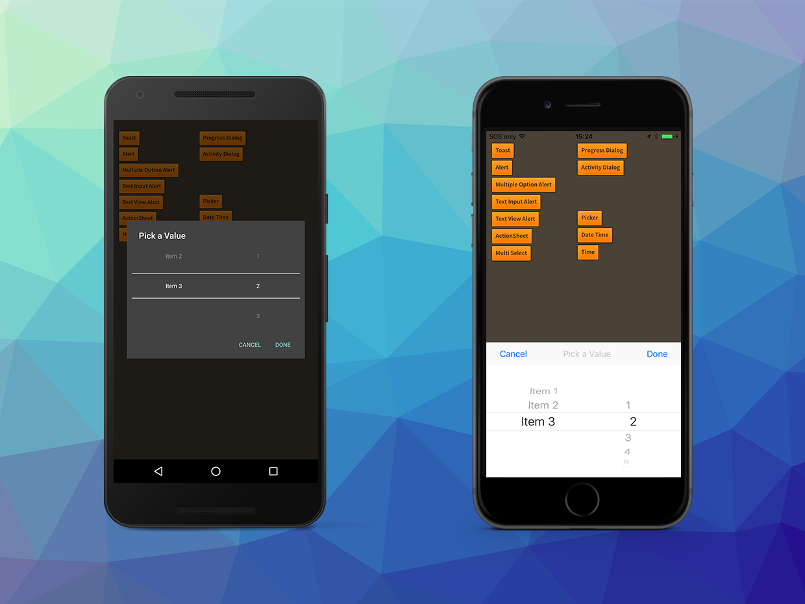

A picker dialog allows you get present a series of 'spinners' to a user to select multiple values 
from a range of possible values.

A picker dialog is created by using a `PickerDialogBuilder` which will create an instance of a 
`PickerDialogView`. Each spinner or column is created by calling `addColumn` on the builder and 
passing an array of possible values and the index of the initially selected value.


```actionscript
var picker:PickerDialogView = Dialog.service.create(
		new PickerDialogBuilder()
			.setTitle( "Pick a Value" )
			.setCancelLabel("Cancel")
			.setAcceptLabel("Done")
			.addColumn( [ "Item 1", "Item 2", "Item 3" ], 2 )
			.addColumn( [ "1", "2", "3", "4", "5", "6" ], 1 )
			.build()
	);
	
picker.addEventListener( DialogViewEvent.CLOSED, picker_closedHandler );
picker.addEventListener( DialogViewEvent.CANCELLED, picker_closedHandler );
picker.addEventListener( DialogViewEvent.CHANGED, picker_changedHandler );
picker.show();

... 

private function picker_changedHandler( event:DialogViewEvent ):void
{
	trace( "picker changed [ " + event.indexes.join(",") + " ] " + event.values.join(",") );
}

private function picker_closedHandler( event:DialogViewEvent ):void
{
	trace( "picker closed ("+event.index+") -> [ " + event.indexes.join(",") + " ] " + event.values.join(",") );
	var picker:PickerDialogView = PickerDialogView(event.currentTarget);
	picker.removeEventListener( DialogViewEvent.CLOSED, picker_closedHandler );
	picker.removeEventListener( DialogViewEvent.CANCELLED, picker_closedHandler );
	picker.removeEventListener( DialogViewEvent.CHANGED, picker_changedHandler );
	picker.dispose();
}
```


### Updating the selected indices

You can change the selected items in the picker by using the `setSelectedIndex` method on the `PickerDialogView`.
For example to change the index of the second column to the fourth value (indexes are zero based):

```actionscript
picker.setSelectedIndex( 1, 3 );
```

