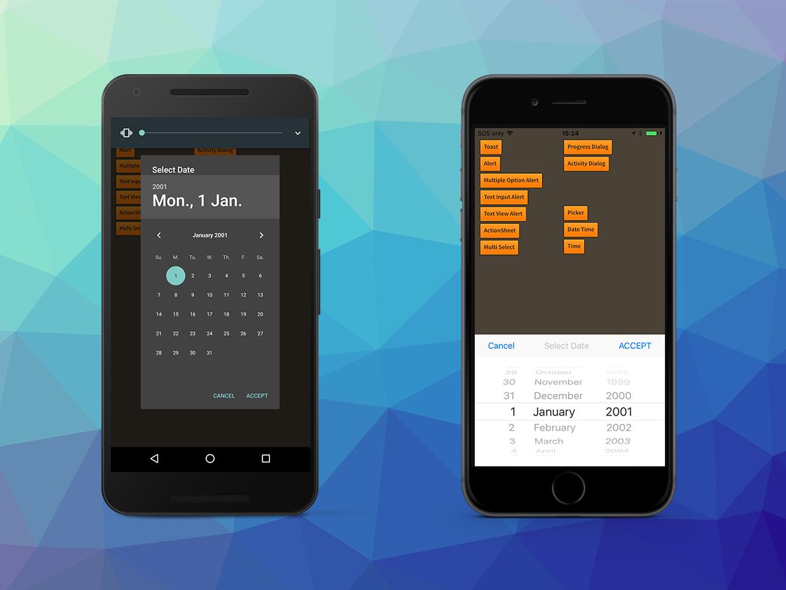
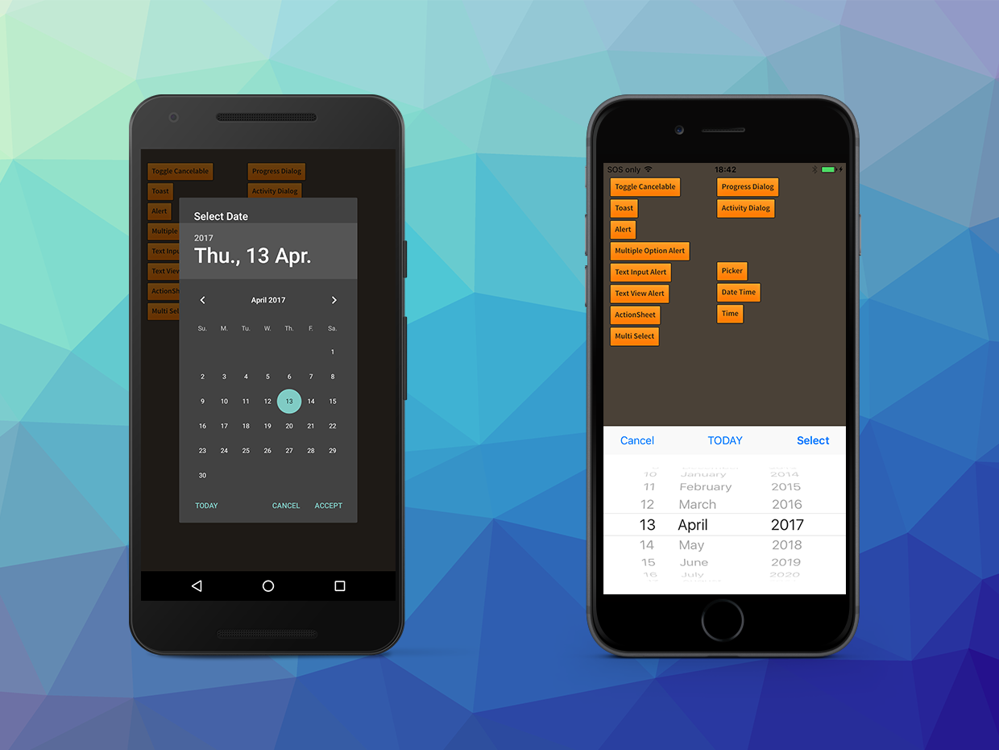

The date/time dialog allows you to request input of a date and/or time from a user. It uses 
the native date/time inputs to give your application a deeply native integration feel.

You can present either a Date dialog which allows selection of a year, month and day, or 
a Time dialog which selects an hour and minute (plus AM/PM if not in 24 hour). 

Additionally on iOS you have access to a combined DateTime dialog which allows selection of a time and date.

To create a `DateTimeDialogView` you pass the result of a `DateTimeDialogBuilder` to the 
`Dialog.service.create()` function. You can then attach listeners and set and retrieve 
the value displayed in the dialog using the `DateTimeDialogView` interface.


```actionscript
var dateTime:DateTimeDialogView = Dialog.service.create( 
					new DateTimeDialogBuilder()
						.setMode( DialogType.MODE_TIME )
						.setTitle( "Select Time" )
						.setAcceptLabel( "ACCEPT" )
						.setCancelLabel( "Cancel" )
						.build()
					);
dateTime.setTime( 9, 30 );

dateTime.addEventListener( DialogViewEvent.CLOSED, dateTime_closedHandler );
dateTime.addEventListener( DialogDateTimeEvent.SELECTED, dateTime_selectedHandler );
				
dateTime.show();

...

private function dateTime_selectedHandler( event:DialogDateTimeEvent ):void
{
	trace( event.type +"::"+ event.date.toString() );
}

private function dateTime_closedHandler( event:DialogViewEvent ):void
{
	var dateTime:DateTimeDialogView = DateTimeDialogView(event.currentTarget);
	dateTime.removeEventListener( DialogViewEvent.CLOSED, dateTime_closedHandler );
	dateTime.removeEventListener( DialogDateTimeEvent.SELECTED, dateTime_changedHandler );
	dateTime.dispose();
}
```


## Adding a TODAY button

You can add a button to the dialog which will allow the user to select the current day
by using the `setTodayLabel` method on the `DateTimeDialogBuilder`.

```actionscript
var builder:DateTimeDialogBuilder = new DateTimeDialogBuilder();
// other options...

builder.setTodayLabel( "Today" );
```

This will add an additional button to the dialog that will set the date to the current date 
as reported by the user's device.

When the user clicks this button you will receive the normal date change events.


