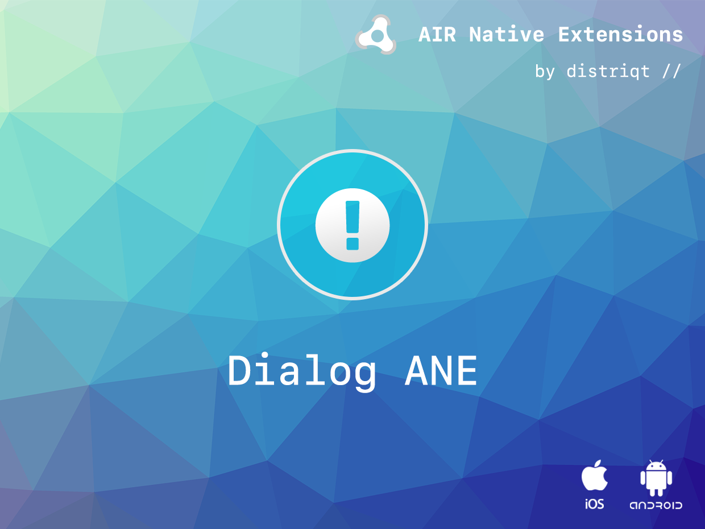
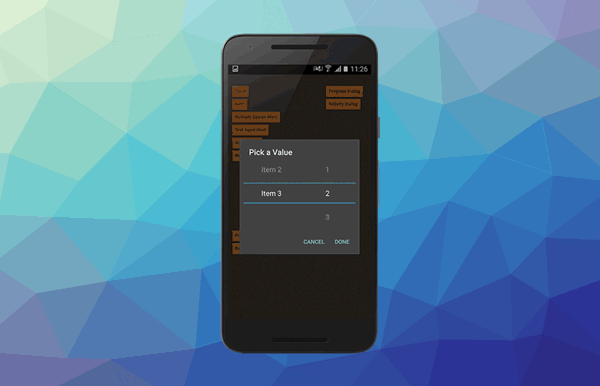
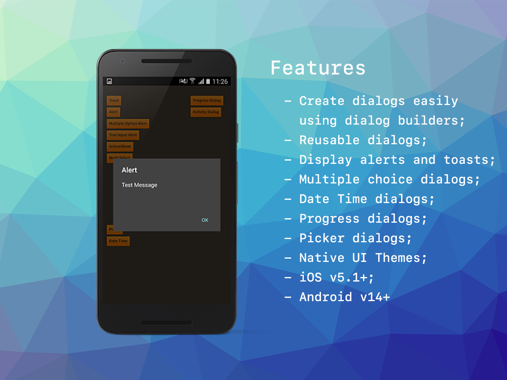

# Dialog

The [Dialog](http://airnativeextensions.com/extension/com.distriqt.Dialog) extension 
allows developers to display and interact with native alerts, dialogs and messages 
on both Android and iOS.

The simple API allows you to quickly integrate user responses in your AIR application 
in just a few lines of code. Identical code base can be used across all platforms 
allowing you to concentrate on your application and not device specifics.

Dialogs provide a simple native way to get a selection from your user, from a complex 
date or time selection to a simple multiple choice answer. You can also use them to 
provide feedback in the form of an alert or a toast message. With this extension you 
will be able to display many different forms of dialogs, giving your application a 
consistent natively integrated UI.

We provide complete guides to get you up and running with dialogs quickly and easily.

### Latest Features

- Create dialogs easily using dialog builders;
- Reuse dialogs using a simple show - dismiss functionality;
- Display simple alerts, toasts and single option dialogs;
- Show progress of long processes using native progress dialogs;
- Picker dialogs with multiple columns of custom values;
- Use themes to best match the native UI to your application

As with all our extensions you get access to a year of support and updates as we are 
continually improving and updating the extensions for OS updates and feature requests.

