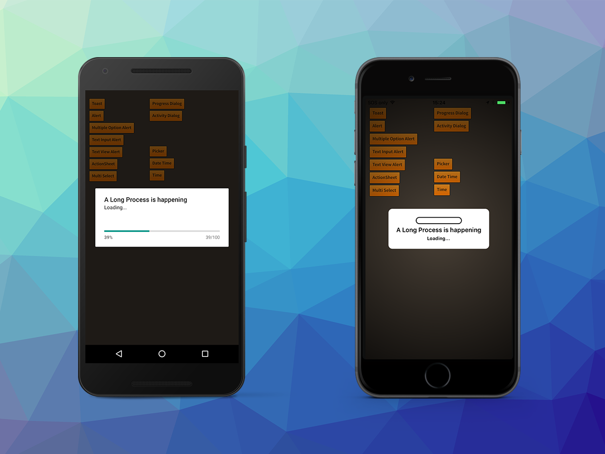

A progress dialog can be used to show the progress of a long running process, such as downloading a file. 
A progress dialog can have a different appearances, such as a indeterminate spinner, a horizontal bar or 
an annular / circular fill.

A progress dialog is created by using an `ProgressDialogBuilder`. The `create` function will return a 
progress dialog specific `DialogView` represented by the `ProgressDialogView` class.

```actionscript
var progressDialog:ProgressDialogView = Dialog.service.create( 
		new ProgressDialogBuilder()
			.setTitle( "A Long Process is happening" )
			.setMessage( "Loading..." )
			.setStyle( DialogType.STYLE_HORIZONTAL )
			.setCancelable( false )
			.setTheme( new DialogTheme( DialogTheme.DEVICE_DEFAULT_LIGHT ))
			.build()
		);

progressDialog.show();
```

## Updating Progress

For a determinate progress dialog you can update the displayed value by calling `update` on the 
`ProgressDialogView` instance.

```actionscript
var progressInterval:uint;
var progress:Number = 0;
var progressDialog:ProgressDialogView;

if (Dialog.isSupported)
{
	progressDialog = Dialog.service.create( 
		new ProgressDialogBuilder()
			.setTitle( "A Long Process is happening" )
			.setMessage( "Loading..." )
			.setStyle( DialogType.STYLE_HORIZONTAL )
			.setCancelable( false )
			.setTheme( new DialogTheme( DialogTheme.DEVICE_DEFAULT_LIGHT ))
			.build()
		);
	progressDialog.addEventListener( DialogViewEvent.CLOSED, progressDialog_closedHandler );
	progressDialog.show();
	
	progress = 0;
	progressDialog.update( progress );
	
	progressInterval = setInterval( progressDialog_intervalHandler, 2000 );
}

...

private function progressDialog_intervalHandler():void
{
	progress += 0.1; // Change the value by some amount
	progressDialog.update( progress );

	if (progress >= 1) // Dismiss the dialog when complete
	{
		clearInterval( progressInterval );
		progressDialog.dismiss();
	}
}

private function progressDialog_closedHandler( event:DialogViewEvent ):void
{
	trace( "progress dialog closed" );
	progressDialog.removeEventListener( DialogViewEvent.CLOSED, progressDialog_closedHandler );
	progressDialog.dispose();
}
```


## Updating Message

Similarly you can update the message displayed in the progress dialog by using the `setMessage()` function on the `ProgressDialogView` instance.

For example you could update the text to represent the percentage complete of the process the progress dialog is tracking:

```actionscript
var percent:Number = ...;

progressDialog.setMessage( "Loading " + percent + "% complete"  );
```


