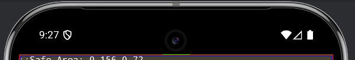
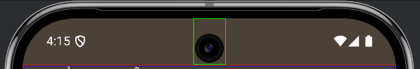
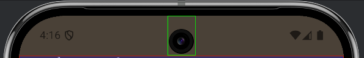

The status bar is the small area at the top of a device that contains information such as the battery level, network connectivity and notification icons. The navigation bar is the area at the bottom of the screen where system navigation controls are generally located. 


You will likely want to draw behind the system status and navigation bars while still allowing user interaction with them. 


The default mode for these with AIR is a solid background which doesn't really fit with modern Android UI design.




The suggested approach is to set the status and navigation bars to be transparent so that your application can be seen behind them.

If you want a solid colour you can simply add a rectangle behind them in your application design, or alternatively you can render your content behind them for a more immersive experience.

You can use the Display extension to set the status and navigation bar styles. These call sets the status bar to have light icons and a transparent background with recent versions of Android.


## Status Bar

### Style

You can control the style of the status bar by using the `Display.setStatusBarStyle()` function. This allows you to set whether the content (icons, time etc) is light or dark, allowing you to better fit the status bar content with your application.

This function takes a `StatusBarStyle` constant as the parameter:

- `StatusBarStyle.LIGHT`: Light (white) icons and status bar content
- `StatusBarStyle.DARK`: Dark (black/grey) icons and status bar content
- `StatusBarStyle.DEFAULT`: Differs between the platforms, is `DARK` on iOS and `LIGHT` on Android


```actionscript
Display.instance.setStatusBarStyle( StatusBarStyle.LIGHT );
```

| Light Status Bar | Dark Status Bar | 
| --- | --- | 
|  |  |


## Navigation Bar

Android contains a navigation bar towards the bottom of the screen, containing the back and menu buttons but varying depending on the version and manufacturer. 

To set the style, you must use one of the constants defined in `NavigationBarStyle`:

- `NavigationBarStyle.LIGHT`: Light navigation bar style will make the icons light for use on dark backgrounds;
- `NavigationBarStyle.DARK`: Dark navigation bar style will make the icons dark for use on light backgrounds


```actionscript
Display.instance.setNavigationBarStyle( NavigationBarStyle.LIGHT );
```

| Light Navigation Bar | Dark Navigation Bar | 
| --- | --- | 
|  |  |


:::note 
The navigation bar style is only relevant when the user has selected to use button navigation rather than gesture navigation on their device.
Gesture navigation displays a small bar at the bottom of the screen which reflects the system dark mode theme setting.
:::

