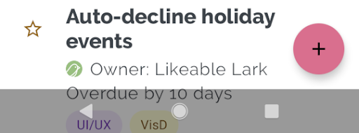

Window Insets refer to areas on some devices that extends into the display surface to allow for an edge-to-edge experience while providing space for important sensors on the front of the device along with system UI elements like status and navigation bars.

Terminology can vary with different platforms and elements here so you may find the terms:
- safe area, window insets
- display cutouts

When dealing with display cutouts the display mode and layout mode affect greatly how the cutouts affect your application. So it's important that you have set the display mode before attempting to deal with cutouts. **The information returned here will change based on the display mode.**


## Support

Android officially supports display cutouts on devices running Android 9 (API level 28) and higher. Edge-to-edge layouts are enforced on Android 14 (API level 35) and higher.

iOS supports notches from iOS 11.


## Edge-to-Edge Layouts

Edge-to-edge layouts means that the window spans the entire width and height of the display by drawing behind the system bars including the status bar, caption bar, and navigation bar.

This means that your content may render behind operating system elements and you will need to account for this in the design and execution of your application. You will likely want to render certain content under the system UI, such as scrolling and non-UI elements however it is important that your interactive elements never get rendered in these areas.

For example in the following a button is obscured by the navigation bar:

| Obscured | Correctly Rendered | 
| --- | --- | 
|  |  |


The safe area will give you information about the padding required to avoid rendering into the status and navigation bars.


## Safe Area

The safe area represents the area of the screen that is guaranteed to be unobstructed by system UI elements. This contains the safe distance from each edge of the device that can be used to display content relative to the current orientation. 

To access this call `getSafeArea()` on the `windowInsets` property of the `Display` singleton instance:

```actionscript
var safeArea:Insets = Display.instance.windowInsets.getSafeArea();
```

The `Insets` object returned contains the safe area insets (i.e. required padding) for each side of the display in pixels. 

- `safeArea.top` - The inset from the top of the display
- `safeArea.left` - The inset from the left of the display
- `safeArea.right` - The inset from the right of the display
- `safeArea.bottom` - The inset from the bottom of the display

You can then use these values to position your interactive elements within the safe area of the display.

For example in portrait, `safeArea.top` will represent the height of any cutout at the top of the device. **This will account not only for notches, the status and navigation bar but also some devices with curved corners.** 

The image below represents the safe area for an iPhone X landscape device, note the area on the right is to keep the controls out of the curved corners and symmetric on the device:


:::note
**Inset essential content to prevent clipping.** In general, content should be centered and symmetrically inset so it looks great in any orientation, isn’t clipped by rounded corners, isn’t hidden by a sensor housing, and isn’t obscured by the navigation bar or the indicator for accessing the Home screen. 
:::

We recommend you should present any UI controls inside the safe insets. You can (and should) draw outside these regions though.


## Display Cutouts 

Display cutouts take the safe area further providing details about the cutouts by camera notches etc so you can accurately render content outside the safe area.

For example the following image shows the bounding rectangle drawn around the camera notch. This would allow you to better control the rendering beneath the status bar, or around the camera notch in immersive mode.


You can retrieve information about the display cutouts by calling `getDisplayCutout()` on the `windowInsets` property of the `Display` singleton instance:

```actionscript
var cutout:DisplayCutout = Display.instance.windowInsets.getDisplayCutout();
```

The `DisplayCutout` class has a property `boundingRects` which is a list of `Rectangle` objects each of which is the bounding rectangle for a non-functional area on the display. There will be at most one non-functional area per edge of the device.

```actionscript
for each (var rect:Rectangle in displayCutout.boundingRects)
{
    // rect represents an area of the screen affected by a cutout
}
```


## Testing 

Be sure to test all of your app's screens and experiences. Test on devices with different types of cutouts, if possible. 


### Android 

If you don't have a device with a cutout, you can simulate some common cutout configurations on any device or emulator running Android 9 by doing the following:

1. Enable developer options.
2. In the Developer options screen, scroll down to the Drawing section, and select Simulate a display with a cutout.
3. Select the cutout type.


