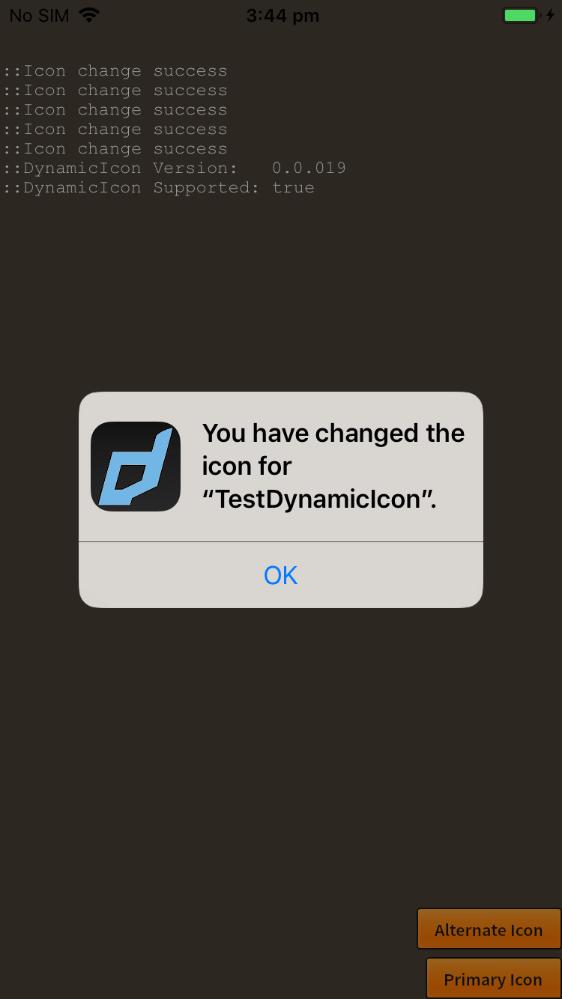

To change the application icon use the `setAlternateIconName()` function and pass the name of the icon you wish to use.

For example, if you added an icon named "AlternateIcon" to your application, you change it using:


```actionscript
DynamicIcon.instance.setAlternateIconName( "AlternateIcon" );
```


To reset the icon to the primary icon, pass either an empty string or `null` to this function:

```actionscript
DynamicIcon.instance.setAlternateIconName( null );
```


Example images:

| Primary | Confirmation | Alternate
|---|---|---|
| [images/icon_primary.png]] ](- | [[images/icon_alternate.png) |


### Listen for Result

You can listen to two events to confirm the icon was changed after a call to `setAlternateIconName()`

- `DynamicIconEvent.SETALTERNATEICON_SUCCESS`: Dispatched if the icon was successfully changed;
- `DynamicIconEvent.SETALTERNATEICON_FAILED`: Dispatched if there was an error changing the icon, check the `error` property on the event for more information;


For example:

```actionscript
DynamicIcon.instance.addEventListener( DynamicIconEvent.SETALTERNATEICON_SUCCESS, successHandler );
DynamicIcon.instance.addEventListener( DynamicIconEvent.SETALTERNATEICON_FAILED, failedHandler );

function setAlternateIcon_successHandler( event:DynamicIconEvent ):void
{
    trace( "Icon change success" );
}
		
function setAlternateIcon_failedHandler( event:DynamicIconEvent ):void
{
    trace( "Icon change error: " + event.error );
}
```


>
> The most common error is a missing icon file: *"The file doesn't exist"*. This is caused because the icon wasn't correctly added to your 
> application when repackaging.
>
> You should expect this error if you are debugging / packaging directly from AIR.
>


### Checking for Support

You can directly check whether the device supports changing the icon by checking the `supportsAlternateIcons` flag:


```actionscript
if (DynamicIcon.instance.supportsAlternateIcons)
{
    // Device supports changing icons
}
```


