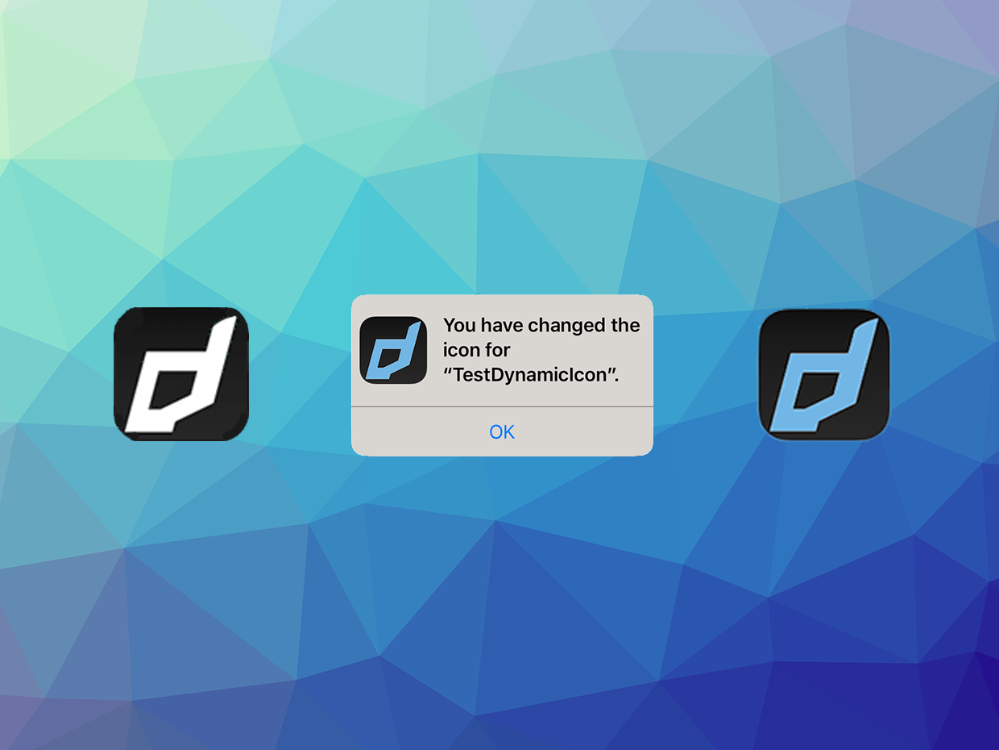

# DynamicIcon

The [DynamicIcon](https://airnativeextensions.com/extension/com.distriqt.DynamicIcon) extension 
gives you the ability to change the application icon displayed for your application.


### Features:

- Change the icon of your application programmatically
- Single API interface - your code works across supported platforms with no modifications
- Sample project code and ASDocs reference


As with all our extensions you get access to a year of support and updates as we are 
continually improving and updating the extensions for OS updates and feature requests.


## Documentation

The [Wiki](https://github.com/distriqt/ANE-DynamicIcon/wiki) forms the best source of detailed documentation for the extension along with 
the [asdocs](https://docs.airnativeextensions.com/asdocs/dynamicicon). 

Quick Example: 

```actionscript
if (DynamicIcon.instance.supportsAlternateIcons)
{
    DynamicIcon.instance.setAlternateIconName( "AlternateIcon" );
}
```

More information here: 

[com.distriqt.DynamicIcon](https://airnativeextensions.com/extension/com.distriqt.DynamicIcon)


## Native Extensions

The highest quality and widest range of Native Extensions for Adobe AIR

With many native extensions available, we are the largest provider of native extensions for AIR developers. Our mobile solutions allow developers to fast-forward development and focus on building great games and apps.

[airnativeextensions.com](https://airnativeextensions.com/)



