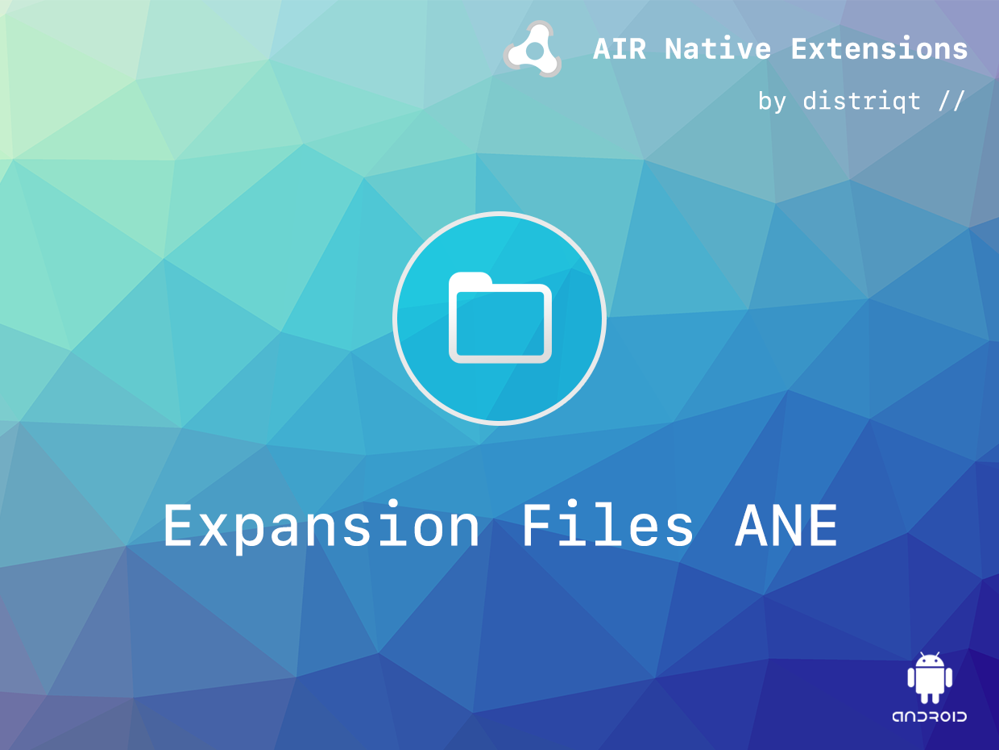

:::warning DEPRECATED
Please note this extension is still functional however Google has deprecated the expansion files functionality in favour of the newer "Play Asset Delivery". 

You should likely have a look at the "Play Asset Delivery extension" available from Harman here: https://github.com/airsdk/ANE-PlayAssetDelivery
:::

# Expansion Files

The [Expansion Files](http://airnativeextensions.com/extension/com.distriqt.ExpansionFiles) extension gives access to Android APK Expansion Files from your AIR application.

Google Play currently requires that your application file be no more than a certain limit. For most applications, this is plenty of space for all the application's code and assets. However, some apps need more space for high-fidelity graphics, media files, or other large assets. Previously, if your app exceeded this limit, you had to host and download the additional resources yourself when the user opens the app. Hosting and serving the extra files can be costly, and the user experience is often less than ideal. To make this process easier for you and more pleasant for users, Google Play allows you to attach two large "expansion files" that supplement your APK.

This ANE gives you access to Expansion Files in your Android AIR application.

The simple API allows you to quickly integrate expansion files in your AIR application in
just a few lines of code. We provide complete guides and asdocs to get you up and running
with expansion files quickly and easily.

We provide complete guides to get you up and running with expansion files quickly and easily.

### Features

- Get expansion file downloaded status;
- Download the expansion files and monitor progress;
- Access to both Main and Patch files;
- Native unzip utilities to extract zip files quickly;
- Mount OBB files for direct file access without extraction;
- Sample project code and ASDocs reference

As with all our extensions you get access to a year of support and updates as we are
continually improving and updating the extensions for OS updates and feature requests.

## Documentation

The [documentation site](https://docs.airnativeextensions.com/docs/expansionfiles) forms the best source of detailed documentation for the extension along with the [asdocs](https://docs.airnativeextensions.com/asdocs/expansionfiles).

More information here:

[com.distriqt.ExpansionFiles](https://airnativeextensions.com/extension/com.distriqt.ExpansionFiles)

## License

You can purchase a license for using this extension:

[airnativeextensions.com](https://airnativeextensions.com/)

distriqt retains all copyright.

