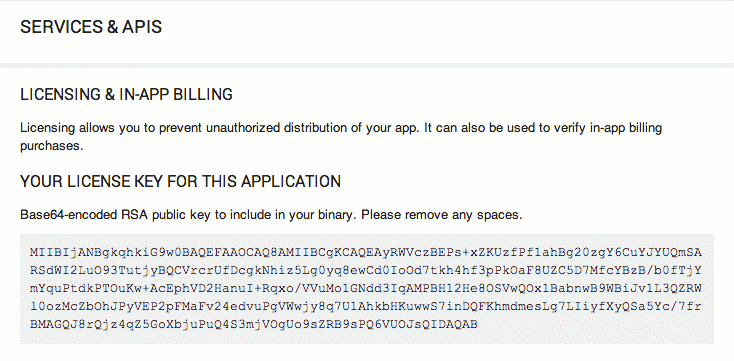

Before you start adding license verification to your application, you need to set 
up your Google Play publishing account, your development environment, and any test 
accounts required to verify your implementation.

Follow the guide from Google to go through the process of setting up a publisher 
account (just the first section until you get your licensing public key): 

- [Setting up for Licensing](http://developer.android.com/google/play/licensing/setting-up.html)

Once you have completed this you will need to copy the base64 encoded string 
representation of your public key for licensing. You can obtain the app's public 
key for licensing in the Services & APIs page (under All Applications)



You will also need to create a salt value which will be used to encrypt and decrypt 
the data as it is written to or read from storage. The salt should be an array of 
20 randomly generated integer values.

The two values (base64 public license key and your salt values) should be passed 
to the `setup` function as in the following example.


```actionscript
public static const BASE64_PUBLIC_KEY	: String = "YOUR_LICENSING_PUBLIC_KEY";
public static const SALT		: Vector.<int> = Vector.<int>( [ 1, 43, -12, -1, 54, 98, -100, -12, 43, 2, -8, -4, 9, 5, -106, -108, -33, 45, -1, 84 ]); 
```

```actionscript
ExpansionFiles.init( "APP_KEY" );
				
trace( "ExpansionFiles Supported: " + ExpansionFiles.isSupported );
trace( "ExpansionFiles Version:   " + ExpansionFiles.service.version );

if (ExpansionFiles.isSupported)
{
    ExpansionFiles.service.setup( BASE64_PUBLIC_KEY, SALT );
}
```
