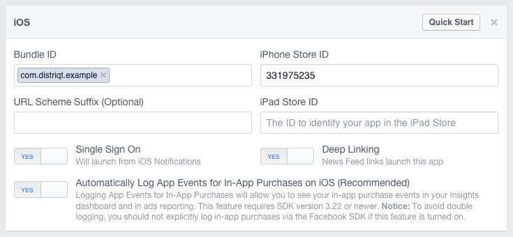

:::caution
This is the legacy extension documentation. Find the new documentation [here](../facebookapi/)
:::

## Setup: Facebook iOS App

For iOS, you'll need to set some properties about your app here. 
Here's an example of the settings we're using:

Bundle ID: This is the ID of your AIR application as set in your application descriptor. 
This is generally a reverse DNS style name, such as com.distriqt.example.

iPhone Store ID / iPad Store ID: This will be the iTunes app ID of your app when published. At this stage, you probably won't have this ID since it's a new app. You can just use another app ID here for now, and replace it later once your iOS app is live. We're just using the ID of Adobe Photoshop Express for the time being, which is 331975235.

URL Scheme Suffix: This is only required if you want to share your app ID across multiple apps - for example, if you wanted to have a free and a paid version of your app. You can read more about this here: https://developers.facebook.com/docs/ios/troubleshooting.

Single Sign On: Turn this to ON. This is required for users to be able to log in through your application.

Deep Linking: Turn this to ON. This is not required, but will be needed if you want to be able to link back to your app from Facebook links.

