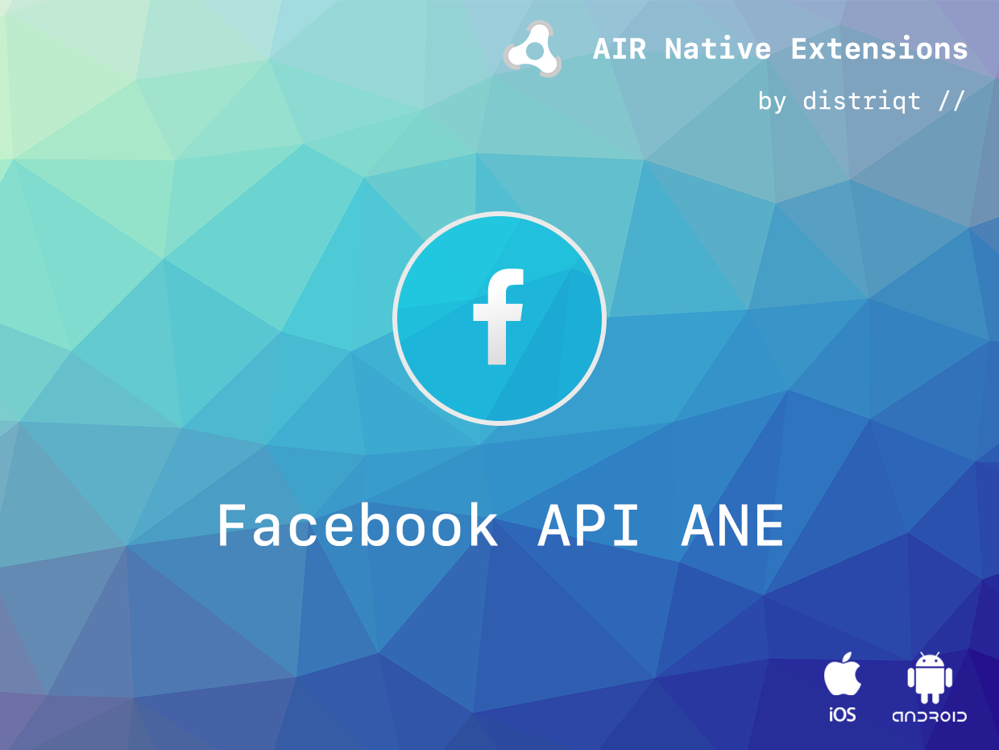

:::caution
This is the legacy extension documentation. Find the new documentation [here](../facebookapi/)
:::

# FacebookAPI

The [FacebookAPI](https://airnativeextensions.com/extension/com.distriqt.FacebookAPI) 
allows you to connect users with Facebook and utilise the integrated SDK and Facebook 
application features.

### Features

- [Facebook Login](login---overview) through the native app, integrated iOS dialogs, and fallbacks to browser-based SSO login.
- [Facebook Sharing](sharing---overview)
- [Facebook Messenger](sharing---message-dialog) integration
- [App Events](app-events---overview)
- [App Links](app-links---overview)
- [Game Requests](games---overview)
- [Graph API](graph-api---overview)
- [Account Kit](account-kit---overview)

As with all our extensions you get access to a year of support and updates as we are 
continually improving and updating the extensions for OS updates and feature requests.

