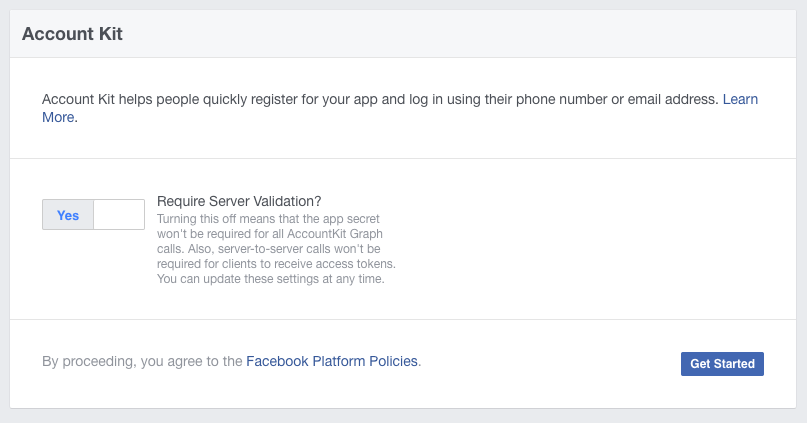
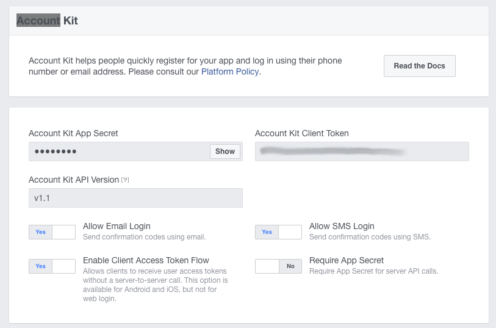

>
> **Account Kit has been discontinued and has been removed**
>
> Account Kit was deprecated on March 9, 2020. For more information, see [Account Kit services no longer available starting in March](https://developers.facebook.com/blog/post/2019/09/09/account-kit-services-no-longer-available-starting-march). 
>
> 

## Add Account Kit

Click "Add Product"  and select the "Account Kit" option.

Enable the services you will allow in your application and take note of the "Account Kit Client Token", 
you will need this when adding the extension to your applicaiton.

Also at this point you should setup the display options as you require changing the colours of the UI to match your application.

