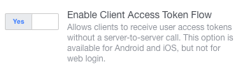

>
> **Account Kit has been discontinued and has been removed**
>
> Account Kit was deprecated on March 9, 2020. For more information, see [Account Kit services no longer available starting in March](https://developers.facebook.com/blog/post/2019/09/09/account-kit-services-no-longer-available-starting-march). 
>
> 


## Support

You can check if Account Kit is supported on the current device by using the `isSupported` flag:

```actionscript
if (FacebookAPI.service.accountKit.isSupported)
{
	// Account Kit is available
}
```


## Setup

Firstly you will need to setup Account Kit specifying the type of response your application
is configured for.

This is a matter of calling `setup` with the appropriate `ResponseType`:

```actionscript
FacebookAPI.service.accountKit.setup( ResponseType.ACCESS_TOKEN );
```

There are two types of responses:

- `ResponseType.ACCESS_TOKEN`
- `ResponseType.AUTHORISATION_CODE`

Which you use is determined by whether you have enabled the "Enable Client Access Token Flow" 
setting in your applicaiton:



If you have enabled it use the `ACCESS_TOKEN` type otherwise use the `AUTHORISATION_CODE`.
If you use `AUTHORISATION_CODE` you will need to exchange the code for an access token
using your server in order to access additional information such as the account details.


## Login 

Your users can login with either a phone number or email, depending on what you have 
enabled in your application settings.

Any of the login processes will dispatch one of the following events:

- `LOGIN_WITH_AUTHORISATIONCODE`: If login was successful and an authorisation code is available
- `LOGIN_WITH_ACCESSTOKEN`: If login was successful and an access token is available
- `CANCELLED`: If the user cancelled the login
- `ERROR`: If an error occurred during the login

Example:

```actionscript
FacebookAPI.service.accountKit.addEventListener( AccountKitEvent.LOGIN_WITH_AUTHORISATIONCODE, loginAuthorisationCodeHandler );
FacebookAPI.service.accountKit.addEventListener( AccountKitEvent.LOGIN_WITH_ACCESSTOKEN, loginAccessHandler );
FacebookAPI.service.accountKit.addEventListener( AccountKitEvent.CANCELLED, cancelledHandler );
FacebookAPI.service.accountKit.addEventListener( AccountKitEvent.ERROR, errorHandler );
```

```actionscript
private function loginAuthorisationCodeHandler( event:AccountKitEvent ):void 
{
	trace( event.type +"::"+event.authorisationCode );
}

private function loginAccessHandler( event:AccountKitEvent ):void 
{
	trace( event.type +"::"+event.accessToken.tokenString );
}

private function cancelledHandler( event:AccountKitEvent ):void 
{
	trace( event.type );
}

private function errorHandler( event:AccountKitEvent ):void 
{
	trace( event.type +"::["+event.errorCode+"] "+event.errorMessage );
}
```

### Login with Phone

To login using the user's phone number you call the `loginWithPhone` function. 

```actionscript
FacebookAPI.service.accountKit.loginWithPhone();
```

You can prefill the phone number entry by specifying the country code and phone number:

```actionscript
FacebookAPI.service.accountKit.loginWithPhone( "+61", "0400000000" );
```


### Login with Email

To login using the user's email address you call the `loginWithEmail` function:

```actionscript
FacebookAPI.service.accountKit.loginWithEmail();
```

Again you can prefill this:

```actionscript
FacebookAPI.service.accountKit.loginWithEmail( "test@example.com" );
```


## Account Information

If you have received an access token you can use the `getAccountInfo` function
to query the details the user used to login. This function will dispatch one 
of the following events:

- `AccountKitEvent.ACCOUNTINFO`: on success
- `AccountKitEvent.ACCOUNTINFO_ERROR`: if an error occurred


```actionscript
FacebookAPI.service.accountKit.addEventListener( AccountKitEvent.ACCOUNTINFO, accountInfoHandler );
FacebookAPI.service.accountKit.addEventListener( AccountKitEvent.ACCOUNTINFO_ERROR, accountInfoErrorHandler );

FacebookAPI.service.accountKit.getAccountInfo();
```

```actionscript
private function accountInfoHandler( event:AccountKitEvent ):void 
{
	// event.account will contain the account info
	trace( event.type + "::" + event.account.toString() );
}

private function accountInfoErrorHandler( event:AccountKitEvent ):void 
{
	trace( event.type +"::["+event.errorCode+"] "+event.errorMessage );
}
```