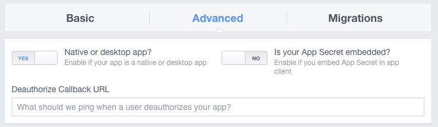
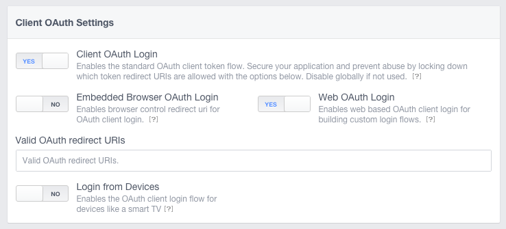

## Setup: Advanced Facebook Settings

Finally, on the Settings page for your Facebook app, select Advanced in the top menu.

Under App Restrictions, ensure that Native or desktop app is set to YES,

And under Client OAuth Settings, ensure that Client OAuth Login is set to YES.

