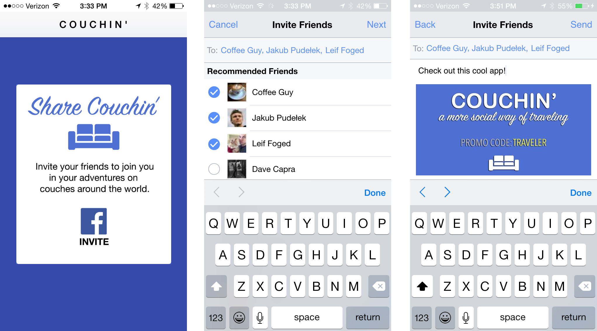

## App Links

The App Links protocol is a cross-platform, open-source protocol for simple mobile deep-linking. 
App Invites uses App Links to determine which apps to display on install and what URL to pass 
to your app. Read more about App Links at applinks.org or read Facebook's guide on App Links.

The following is an example of App Link markup.

```html
<html>
<head>
    <meta property="al:ios:url" content="couchinapp://invite_from_fb?referral=123456789" />
    <meta property="al:ios:app_store_id" content="123456789" />
    <meta property="al:ios:app_name" content="Couchin'" />
    <meta property="al:android:url" content="couchinapp://invite_from_fb?referral=123456789" />
    <meta property="al:android:app_name" content="Couchin" />
    <meta property="al:android:package" content="com.mycompany.couchin" />
    <meta property="al:web:url" content="http://www.couchinapp.com/myapp.html" />
</head>
<body>
  Couchin App Link
</body>
</html>
```


### App Link Tool

You can use our tool to create App Links hosted on Facebook. This is useful if you're a mobile 
developer and you don't want to host any content on the web.

[Create App Link](https://developers.facebook.com/quickstarts/?platform=app-links-host)


## App Invites

>
> Starting 6th February 2018, App Invites will no longer be supported. Starting with SDK version 4.28 and above.
>
> See the notice [here](https://developers.facebook.com/blog/post/2017/11/07/changes-developer-offerings/)
>
> For an alternative see the [Game Request Dialog](games---game-request-dialog)
>


App Invites are a content-rich, personal way for people to invite their Facebook friends to a mobile app.

You can integrate App Invites into your app in place where people want to invite friends to your app. 
When the person taps the invite button, you can trigger the flow to send invites.





The person who wants to send invitations sees a UI flow where they can select the recipients and add a personalized message to the invite.

As the app developer, you can also include an image as part of the invite. If someone selects multiple recipients, each recipeint will receive an individual invite. Once the invite is sent or canceled, the person will return back to the app.

Facebook Login is not required for app invites because the experience takes place in the Facebook native mobile app. As a result, you should check to make sure this feature is available and hide the flow if it isn't.
