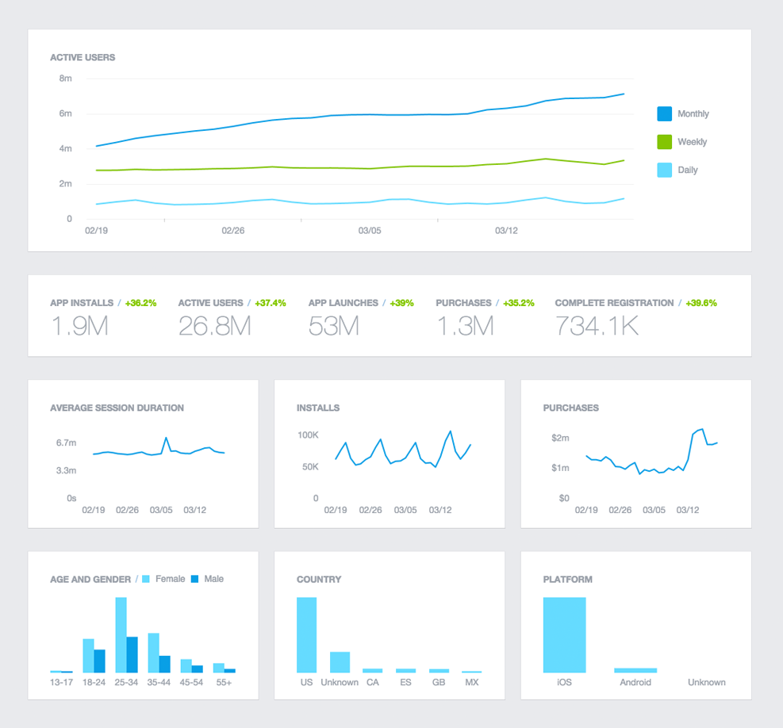

Facebook Analytics for Apps helps you understand how people are using your desktop 
and mobile websites, iOS and Android apps and even Bots for messenger. With well 
over 1.7B monthly users and growing, we built Analytics for Apps using the same 
tools, techniques and infrastructure to help you grow your business.

Whether you're focused on retention, engagement, or conversion, Analytics for Apps 
has the tools you need, including funnels, cohorts, segmentation, breakdown tables, 
automated push campaigns and more. We also provide deep demographic information and 
audience insights to help you understand your audience, and more accurately segment 
to analyze behavior. Think of it as your one-stop growth shop:

- It's completely free to use no matter how many users your apps have or events you send.
- Your app doesn't need to use Facebook Login or any other Facebook service.
- Your data is visible in minutes, not days.


Add events to your app to view analytics, measure ad performance and build audiences for ad targeting

Adding App Events to your app or website helps you learn more about your audience 
and the actions people take across platforms in Facebook Analytics for Apps. 
In Analytics for Apps, you can get powerful, aggregated demographics and rich 
insights about people's behaviors, such as how many people launch your app or 
visit your website, how often people make purchases, and many other events, 
including any custom events that you define.

App Events can also be used to measure your mobile app install ads performance, 
build Custom Audiences for ad targeting and optimize your mobile app engagement ads.


## Learn more about App Events

### Best Practices

Learn best practices for implementing App Events, depending on your particular type of business. See examples for apps in e-commerce, retail, gaming and travel.

[Best Practices](https://developers.facebook.com/docs/platforminsights/appevents/guide)


### FAQ

Learn the most common questions developers have related to integrating App Events and using Facebook Analytics for Apps.

[FAQs](https://developers.facebook.com/docs/app-events/faq)


## Analytics for Apps

Enabling App Events means that you can automatically start using Facebook Analytics for Apps. 
This analytics channel provides demographic info about the people using your app, offers tools 
for better understanding the flows people follow in your app, and lets you compare cohorts 
of different kids of people performing the same actions.

See the documentation for [Facebook Analytics for Apps](https://developers.facebook.com/docs/analytics) for more information.




## iOS App Tracking Transparency

With iOS 14+ you now need to request authorisation to track users. This applies directly to app events and you won't be able to receive them on iOS without having gained this authorisation. 

To do so, add the [`com.distriqt.IDFA`](https://airnativeextensions.com/extension/com.distriqt.IDFA) extension to your application (it's a free extension). Then request authorisation and inform Facebook as below :


```actionscript
IDFA.service.requestAuthorisation( function( authorisationStatus:String ):void 
{
	Facebook.instance.setAdvertiserTrackingEnabled(
			authorisationStatus == TrackingAuthorisationStatus.AUTHORISED
	);
});
```

More information on this [here](https://docs.airnativeextensions.com/docs/idfa/get-advertising-identifier#requesting-authorisation).
