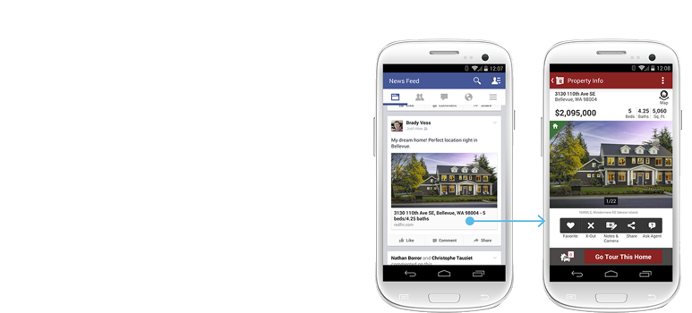
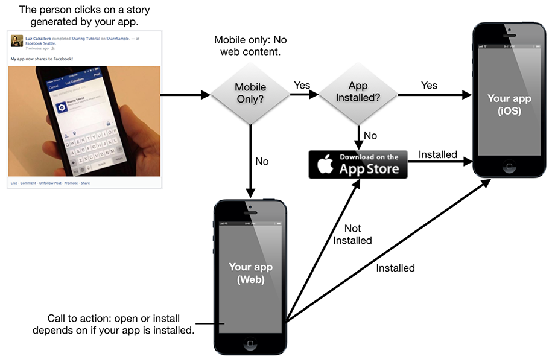
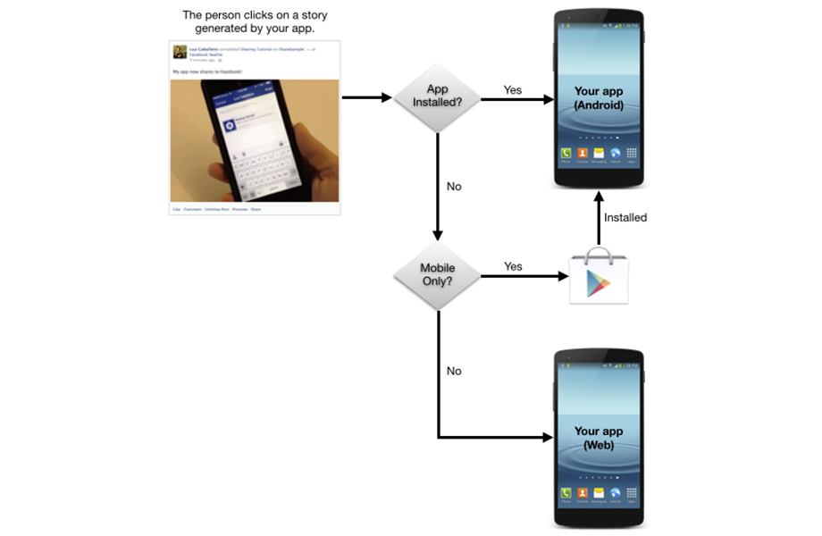

App Links is an open omni-channel solution for deep linking to content in your mobile app




Your app can post stories to news feed. When people click on those stories, Facebook can send people to either your app or your app's App Store page. This drives traffic and app installs. You can implement this behavior using App Links.

When someone taps on one of the links shared through your app or on the story attribution (name of your app) in one of the Open Graph stories shared through your app, the link content appears in a webview with a menu item Open in {app name}. Clicking on that menu item will either open your app or, if the your app is not installed on the device, open your app's App Store page. If your app is mobile-only and has no web content, when someone clicks the shared link they either open your app, if it's installed, or go to your app's App Store page (if your app isn't installed). The image below shows this flow:


| iOS |  |
| --- | --- | 
| Android |  |


In either case, once the person reaches your app (directly or after the app install), information will be passed in an event that can be used by your app to decide what to show the person to provide continuity in the user experience. For example, if I see a story on my Facebook feed about one of my friends completing this share tutorial and I tap on it, I will expect to be redirected to a view in your app that features this tutorial and not to your app's main activity.


## Format

The App Links protocol is a cross-platform, open-source protocol for simple mobile deep-linking. App Invites uses App Links to determine which apps to display on install and what URL to pass to your app. Read more about App Links at applinks.org or read Facebook's guide on App Links.

The following is an example of App Link markup.

```html
<html>
<head>
    <meta property="al:ios:url" content="customscheme://example" />
    <meta property="al:ios:app_store_id" content="12345" />
    <meta property="al:ios:app_name" content="your facebook app" />

    <meta property="al:android:url" content="customscheme://example" />
    <meta property="al:android:package" content="air.com.example.app" />
    <meta property="al:android:app_name" content="your facebook app" />

    <meta property="al:web:should_fallback" content="false" />

    <meta property="og:title" content="facebook applinks test" />
    <meta property="og:type" content="website" />
    <meta property="og:url" content="https://example.com/applink.html" />
    <meta property="og:description" content="facebook applinks test" />
    <meta property="og:image" content="https://example.com/image.png" />
    <meta property="fb:app_id" content="XXXXXXXXXXXXXXX" />

    <!-- Other headers -->
</head>
<body>
	Facebook AppLink Test
</body>
</html>
</head>
```

More information here: https://developers.facebook.com/docs/applinks/add-to-content


>
> Note: Facebook AppLinks while described as an "open" protocol really have only been implemented by Facebook. 
> So you shouldn't expect these to work in a normal browser. 
> 
> Instead you must share the link in Facebook and click on the link in the Facebook app on your device.
>