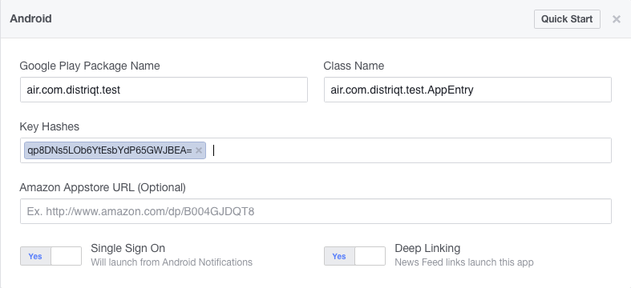

## Setup: Facebook Android App

For Android, you'll need to set some properties about your app here. Here's an example of the settings we're using:



| | |
|---|---|
| **Google Play Package Name** | This is the ID of your AIR application as set in your application descriptor. This is generally a reverse DNS style name, such as `air.com.distriqt.test`. *Be sure to note the `air` prefix*  |
| **Class Name** | This is the name of the base Android AIR class which launches your app. It will be the same as your app ID, but with the prefix air and the suffix `.AppEntry`. For example, our app would use `air.com.distriqt.test.AppEntry` |
| **Single Sign On** | Turn this to ON. This is required for users to be able to log in through your application. |
| **Deep Linking** | Turn this to ON. This is not required, but will be needed if you want to be able to link back to your app from Facebook links. |
| **Key Hashes** | See the following section for instructions on how to generate your key hashes for Android. |


## Android: Key Hashes

Android Facebook apps require that you enter one or more key hashes from the certificates 
used when building and sigining your APK application. There are generally different 
signatures used with development and release versions, so you will likely need to add 
two of these values. 

The key hash is a 28 digit string ending with an `=`:

```
qp8DNs5LOb6YtEsbYdP65GWJBEA=
```

Facebook has documentation on this process [here](https://developers.facebook.com/docs/android/getting-started#create_hash), 
however we outline the key concepts below.

The first step is to locate the certificate file (`p12`) you are using to sign your 
application. 

Once you've located the correct P12 certificate file(s), run the following command, 
replacing `CERTIFICATE.p12` with your certificate file path.

```
keytool -export -alias 1 -storetype pkcs12 -keystore CERTIFICATE.p12 | openssl sha1 -binary | openssl base64
```

The output of this command is the value you need to paste into the Facebook 
Android settings key hash fields.

The alias parameter is usually 1, however this may not always be the case. In order to 
verify that, you can run the following command, again replacing CERTIFICATE.p12:

```
keytool -v -list -keystore CERTIFICATE.p12 -storetype pkcs12
```

Which will output some information about the certificate, including a value 
called Alias name. This is the alias parameter that's required.


### Flash Builder

If you are running debug builds from Flash Builder, it uses a different 
P12 file than you might expect. You'll need to get the key hash from the 
following certificate for debug builds. 

On OSX:

```
/Applications/Adobe Flash Builder 4.7/eclipse/plugins/com.adobe.flexide.multiplatform.android_4.7.0.349722/resources/debug-certificate-android.p12
```

On Windows it will be similar to:

```
C:\Program Files\eclipse\plugins\com.adobe.flexide.multiplatform.android_4.7.0.349722\resources\debug-certificate-android.p12
```


