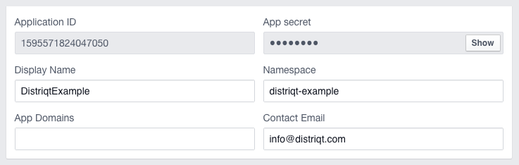

## Setup your Facebook Application

The [Facebook documentation](https://developers.facebook.com/docs) contains information 
and instructions for everything relating to their SDKs, and can be useful if you need 
more information on anything found here.

To get started, you will first need to create a Facebook application at the [Facebook developer site](http://developers.facebook.com/. 
Select **Add a new app** under the **My Apps** menu, and choose either iOS or Android 
and enter a name to get started setting up your application. We'll be creating an 
example app in this tutorial as a demonstration. We'll call it **Distriqt Example**. 
You should change any relevant settings shown from now on to match what's required 
for your own app.

The Facebook site will bring up a **Quick Start** process, which you can just skip 
by selecting **Skip Quick Start** in the top right. That will take you to the main 
dashboard settings page. Select the **Settings** option in the left menu to continue.

Enter the basic information for your app, including **Display Name**, **Namespace**, 
**App Domains** and **Contact Email**. 

Here's an example of the settings we'll use for our app:

At this point you will need to add the relevant platforms you need to support. 
The following sections cover the setup for iOS and Android separately, so select Add Platform, then choose either iOS or Android and continue below.

