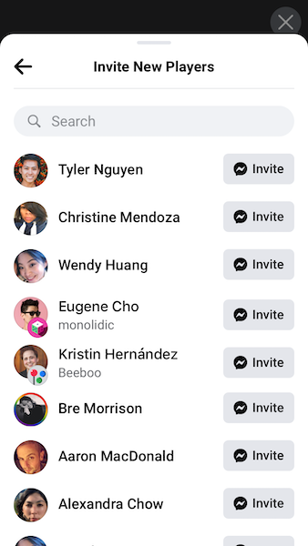
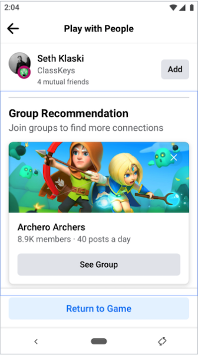
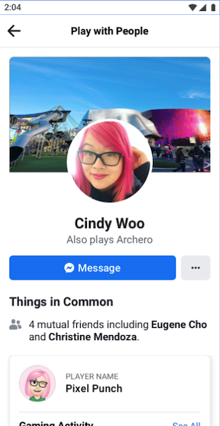

Expand your player base and build community by connecting your players with their Facebook friends. Player Finder lets users find friends to share their gaming experience with. Having more friends playing is associated with higher retention for new players playing top social and turn-based games.

Player Finder connects people with their friends who are playing the same game. Unlike the user/friends Graph API which requires an App with user_friends permission, Player Finder does not require this permission; the connections are rendered as a Player Finder Dialog surfaced within the Facebook App.

Player Finder expands beyond players' social graph of direct Facebook friends, letting players connect with people with similar interests through groups.

|  |  |  | 
| --- | --- | --- |


## Implementation

A typical use of the Player Finder Dialog is as follows:

- Provide a button to open our Player Finder deeplink URL in your app to App Switch to Facebook
- User selects people they want to invite or sees group to connect with.
- Users will be redirected back to your app via App switch from Facebook upon closing the Player Finder Dialog

There is no other work needed other than ensuring that your application settings make app switching back to your app works properly and invoking the deep link.


## Show 

In order to show the friend finder dialog simply call the `show()` function at the appropriate time in your application:


```actionscript
FacebookGamingServices.instance.friendFinderDialog.show();
```


The extension will dispatch an event based on the response from the dialog:

- `FriendFinderDialogEvent.COMPLETE`: Dispatched when the dialog was closed and the user completed the process;
- `FriendFinderDialogEvent.CANCEL`: Dispatched if the dialog was cancelled by the user;
- `FriendFinderDialogEvent.ERROR`: Dispatched if there was an error, the `errorMessage` of the event will contain more details;


```actionscript
FacebookGamingServices.instance.friendFinderDialog.addEventListener( FriendFinderDialogEvent.COMPLETE, completeHandler );
FacebookGamingServices.instance.friendFinderDialog.addEventListener( FriendFinderDialogEvent.CANCEL, cancelHandler );
FacebookGamingServices.instance.friendFinderDialog.addEventListener( FriendFinderDialogEvent.ERROR, errorHandler );
					

function completeHandler( event:FriendFinderDialogEvent ):void
{
    trace( "completeHandler()" );
}
		
function cancelHandler( event:FriendFinderDialogEvent ):void
{
	trace( "cancelHandler()" );
}
		
function errorHandler( event:FriendFinderDialogEvent ):void
{
	trace( "errorHandler() " + event.errorMessage );
}
```