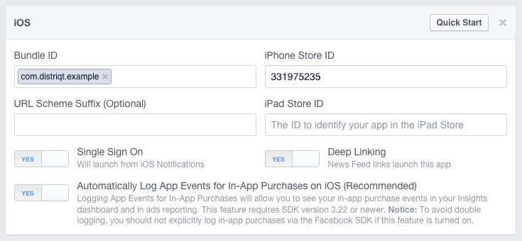
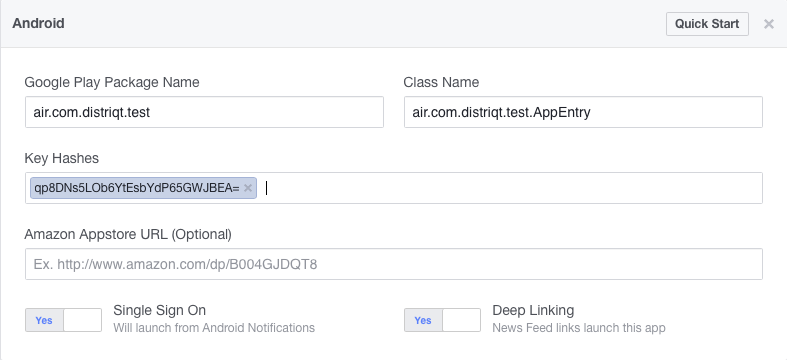

The Facebook SDK is the easiest way to integrate your app with Facebook. It enables:

- Facebook Analytics - Understand how people are using your product.
- Facebook Login - Authenticate people with their Facebook credentials.
- Share and Send dialogs - Enable sharing content from your app to Facebook.
- App Events - Log events in your application.
- Graph API - Read and write to Graph API.


## Before You Start

You will need:

- **A Facebook for Developers Account** If you need one, click this button and follow the steps.

[Create a Facebook for Developers Account](https://developers.facebook.com)


### Get Your App ID 

Each app that you create has a unique ID. To get the ID for an app, do the following:

- Sign into your [developer account](https://developers.facebook.com/).
- Open the [Apps page](https://developers.facebook.com/apps/).
- Find your app and click the **App ID**. The app ID is copied to the clipboard.


### Get Your Client Token 

Each app that you create has a unique client token that you use to access Facebook. For more information, see Access Tokens. To get the Client Token for an app, do the following:

- Sign into your [developer account](https://developers.facebook.com/).
- On the [Apps page](https://developers.facebook.com/apps/), select an app to open the dashboard for that app.
- On the **Dashboard**, navigate to **Settings** > **Advanced** > **Security** > **Client token**.


## Setup your Facebook Application

The [Facebook documentation](https://developers.facebook.com/docs) contains information and instructions for everything relating to their SDKs, and can be useful if you need more information on anything found here.

To get started, you will first need to create a Facebook application at the [Facebook developer site](http://developers.facebook.com/. 
Select **Add a new app** under the **My Apps** menu, and choose either iOS or Android and enter a name to get started setting up your application. We'll be creating an example app in this tutorial as a demonstration. We'll call it **Distriqt Example**. 
You should change any relevant settings shown from now on to match what's required for your own app.

The Facebook site will bring up a **Quick Start** process, which you can just skip by selecting **Skip Quick Start** in the top right. That will take you to the main dashboard settings page. Select the **Settings** option in the left menu to continue.

Enter the basic information for your app, including **Display Name**, **Namespace**, **App Domains** and **Contact Email**. 

Here's an example of the settings we'll use for our app:


At this point you will need to add the relevant platforms you need to support. The following sections cover the setup for iOS and Android separately, so select Add Platform, then choose either iOS or Android and continue below.


### Facebook iOS App

For iOS, you'll need to set some properties about your app here. Here's an example of the settings we're using:



Bundle ID: This is the ID of your AIR application as set in your application descriptor. 
This is generally a reverse DNS style name, such as com.distriqt.example.

iPhone Store ID / iPad Store ID: This will be the iTunes app ID of your app when published. At this stage, you probably won't have this ID since it's a new app. You can just use another app ID here for now, and replace it later once your iOS app is live. We're just using the ID of Adobe Photoshop Express for the time being, which is 331975235.

URL Scheme Suffix: This is only required if you want to share your app ID across multiple apps - for example, if you wanted to have a free and a paid version of your app. You can read more about this here: https://developers.facebook.com/docs/ios/troubleshooting.

Single Sign On: Turn this to ON. This is required for users to be able to log in through your application.

Deep Linking: Turn this to ON. This is not required, but will be needed if you want to be able to link back to your app from Facebook links.


### Facebook Android App

For Android, you'll need to set some properties about your app here. Here's an example of the settings we're using:



| | |
|---|---|
| **Google Play Package Name** | This is the ID of your AIR application as set in your application descriptor. This is generally a reverse DNS style name, such as `air.com.distriqt.test`. *Be sure to note the `air` prefix*  |
| **Class Name** | This is the name of the base Android AIR class which launches your app. It will be the same as your app ID, but with the prefix air and the suffix `.AppEntry`. For example, our app would use `air.com.distriqt.test.AppEntry` |
| **Single Sign On** | Turn this to ON. This is required for users to be able to log in through your application. |
| **Deep Linking** | Turn this to ON. This is not required, but will be needed if you want to be able to link back to your app from Facebook links. |
| **Key Hashes** | See the following section for instructions on how to generate your key hashes for Android. |


#### Android: Key Hashes

Android Facebook apps require that you enter one or more key hashes from the certificates used when building and sigining your APK application. There are generally different signatures used with development and release versions, so you will likely need to add two of these values. 

The key hash is a 28 digit string ending with an `=`:

```
qp8DNs5LOb6YtEsbYdP65GWJBEA=
```

Facebook has documentation on this process [here](https://developers.facebook.com/docs/android/getting-started#create_hash), 
however we outline the key concepts below.

The first step is to locate the certificate file (`p12`) you are using to sign your 
application. 

Once you've located the correct P12 certificate file(s), run the following command, 
replacing `CERTIFICATE.p12` with your certificate file path.

```
keytool -export -alias 1 -storetype pkcs12 -keystore CERTIFICATE.p12 | openssl sha1 -binary | openssl base64
```

The output of this command is the value you need to paste into the Facebook 
Android settings key hash fields.

The alias parameter is usually 1, however this may not always be the case. In order to 
verify that, you can run the following command, again replacing CERTIFICATE.p12:

```
keytool -v -list -keystore CERTIFICATE.p12 -storetype pkcs12
```

Which will output some information about the certificate, including a value 
called Alias name. This is the alias parameter that's required.


