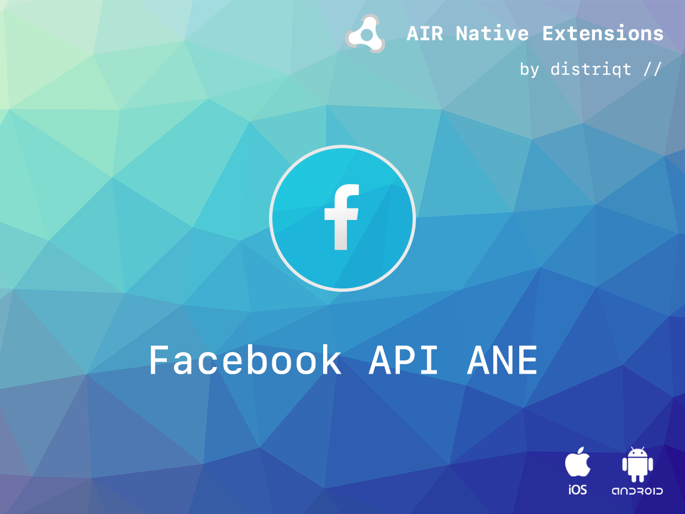

# FacebookAPI

The [FacebookAPI](https://airnativeextensions.com/extension/com.distriqt.FacebookAPI) is a series of extensions that allow you to connect users with Facebook and utilise the Facebook SDK features including analytics, login and sharing.


:::info
If you are looking for the documentation on the legacy implementation you can find that [here](../facebookapi-legacy/)
:::

### Features

The Facebook SDK consists of several components:

- [Facebook Core](core/overview) SDK (includes Analytics)
- [Facebook Login](login/overview) SDK
- [Facebook Sharing](share/overview) SDK
- Facebook Places SDK
- Facebook Marketing SDK


```
 +---------------+---------------+--------------+----------------+
 |     Login     |    Share      |     Places   |    Marketing   |
 |    + Core     |    + Core     |    + Core    |     + Core     |
 | iOS : 1.8 MB  | iOS : 2.3 MB  | iOS : 2.6 MB |  iOS : 1.8 MB  |
 | And : 246 KB  | And : 247 KB  | And : 53 KB  |  And : 67 KB   |
 +---------------+---------------+--------------+----------------+
 |                      Core                                     |
 |                     iOS : 1.6 MB                              |
 |                 Android : 52 K                                |
 +---------------------------------------------------------------+
```


If you don't need the functionality of the full SDK, you can save space by using only the SDK(s) you need to support the Facebook products you want to use in your app.

>
> Note that when you use one of the Facebook SDKs, events in your app are automatically logged and collected for Facebook Analytics unless you disable automatic event logging. For details about what information is collected and how to disable automatic event logging, see [Automatic App Event Logging](core/app-events/automatic-logging).
>


As with all our extensions you get access to a year of support and updates as we are continually improving and updating the extensions for OS updates and feature requests.


This site forms the best source of detailed documentation for the extension along with the [asdocs](https://docs.airnativeextensions.com/asdocs/facebookapi/)

[GET STARTED NOW](get-started)

