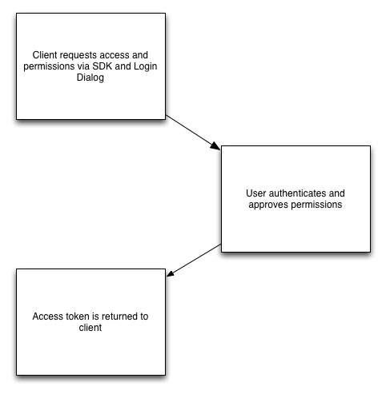

## Access Token

When someone connects with an app using Facebook Login, the app will be able to 
obtain an access token which provides temporary, secure access to Facebook APIs.

An access token is an opaque string that identifies a user, app, or Page and can 
be used by the app to make graph API calls. 

The token includes information about when the token will expire and which app 
generated the token. Because of privacy checks, the majority of API calls on 
Facebook need to include an access token. 


Although each platform generates access tokens through different APIs, all 
platforms follow the basic strategy to get a user token:

  

The users Access Token is represented by the `AccessToken` class.


### Tokens are Portable

One important aspect to understand about access token is that they are portable. 
Once you have an access token you can use it to make calls from a mobile client, 
a web browser, or from your server to Facebook's servers. If a token is obtained 
on a client, you can ship that token down to your server and use it in 
server-to-server calls. If a token is obtained via a server call, you can also 
ship that token up to a client and then make the calls from the client.

Moving tokens between your client and server must be done securely over HTTPS 
to ensure the security of people's accounts. Read more about the implications 
of moving tokens between your clients and your server.


### Access Token class

The [`AccessToken`](http://docs.airnativeextensions.com/asdocs/facebookapi/com/distriqt/extension/facebookapi/AccessToken.html) 
class represents a user's access token. 

You will have access to this after a session is successfully created, it will
be part of the `FacebookAPISessionEvent` event dispatched and also available 
by the `getAccessToken` function:

```actionscript
var token:AccessToken = FacebookAPI.service.getAccessToken();
```

You will need the `token` String for any calls to the Facebook APIs.


### Permissions

You can access the list of granted and denied permissions through the access token.

- `token.permissions`: contains an array of permissions strings that this access token has been granted 
- `token.declinedPermissions`: contains an array of permissions strings that this access token has been denied 

