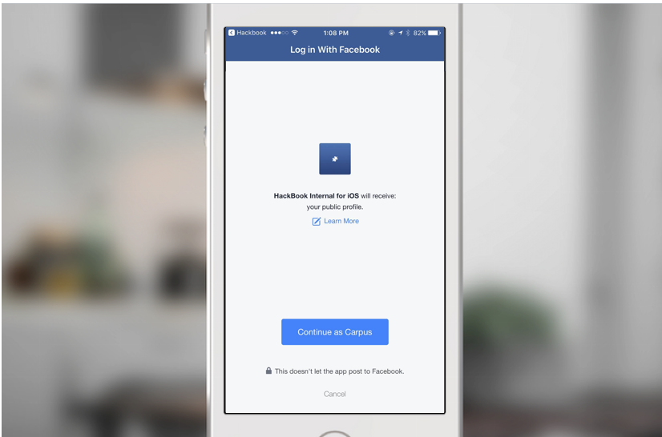

Facebook Login is a secure, fast and convenient way for people to log into your app .

Facebook Login for Apps is a fast and convenient way for people to create accounts and log into your app across multiple platforms. It's available on iOS, Android, Web, Windows Phone, desktop apps and devices such as Smart TVs and Internet of Things objects.

When people log into your app with Facebook they can grant permissions to your app so you can retrieve information or perform actions on Facebook on their behalf.

If people don't have the Facebook app installed, Facebook Login uses Facebook Lite instead to display the login screen and get credentials. Previous SDKs required that people have the Facebook app installed.

For more information see the [Facebook Login documentation](https://developers.facebook.com/docs/facebook-login)
