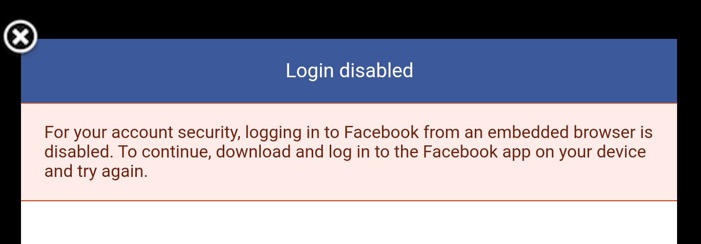
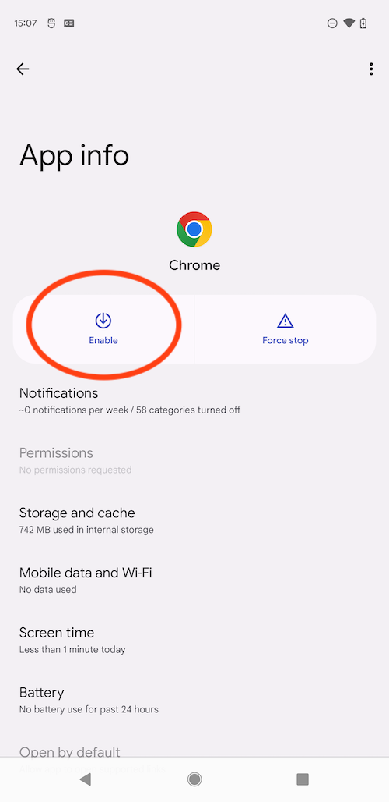

## "Logging in to Facebook from an embedded browser is disabled"

A message along the lines of *"Logging in to Facebook from an embedded browser is disabled"* is an error message that affects many Android users and some iOS users, preventing them from logging in to Facebook via embedded browsers in apps.

The error is caused due to Facebook deprecating support for login through embedded browsers which had been known to cause security issues allowing unauthorised access to accounts.

Generally this shouldn't be encountered unless the device you are using doesn't have the Facebook application installed or the device doesn't support Custom Tabs. 

Custom Tabs sometimes aren't supported if the default browser on the device is old or doesn't support custom tabs. In order to remedy this you can try one or more of the following:

1. Update the default browser application;

2. [Download & install Google Chrome](https://support.google.com/chrome/answer/95346?sjid=5069181482775092556-AP&co=GENIE.Platform%3DAndroid&oco=1)

3. Set [Chrome as the default browser](https://support.google.com/chrome/answer/95417?hl=en&co=GENIE.Platform%3DAndroid&oco=1);

4. Ensure Chrome is enabled in the phone settings: **Settings / Apps / Chrome / Enable**;

