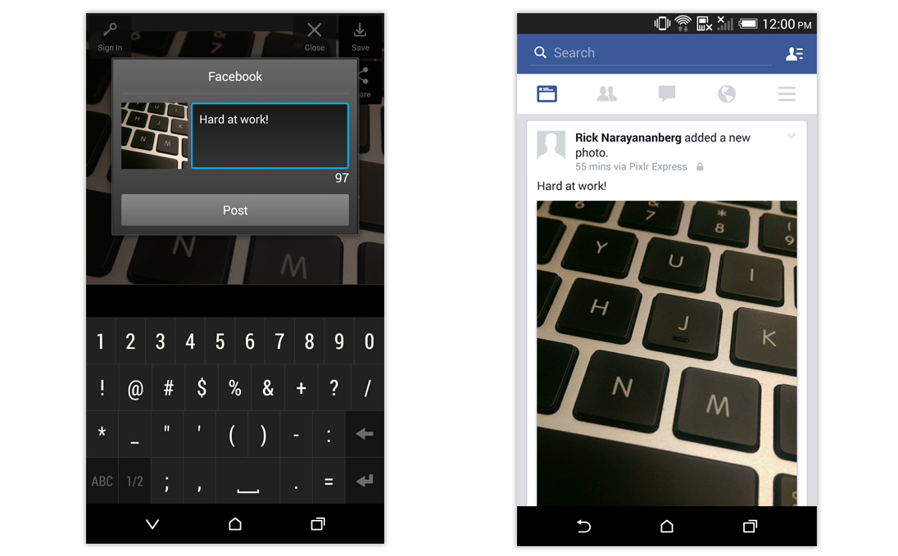

People can share the following kinds of content to Facebook:

- Links - Most content is a URL which references an HTML page. To provide the most relevant information, you should mark up your page with Facebook-specific meta tags. See [A Guide to Sharing for Webmasters](https://developers.facebook.com/docs/sharing/webmasters).

- Photos - Directly upload one or more user-generated photos.

- Videos - Directly upload a user-generated video.

- Multimedia - Directly upload a combination of photos and videos.


## Builders 

To use the share dialog you firstly create a builder to generate the content for the share dialog. There are different builders each representing a different content type.

- [`ShareLinkContentBuilder`](#links): Sharing links;
- [`SharePhotoContentBuilder`](#photos): Sharing photo / image content;
- [`ShareVideoContentBuilder`](#videos): Sharing video content;
- [`ShareMediaContentBuilder`](#media): Sharing multiple photos and/or videos;


### Links 

When people share links from your app to Facebook it includes a contentURL with the link to be shared. Build your share content for links with the `ShareLinkContentBuilder` builder. 

To share links you will be using the `ShareLinkContentBuilder` to construct the content.

```actionscript
var builder:ShareLinkContentBuilder = new ShareLinkContentBuilder()
	.setContentUrl("https://airnativeextensions.com/extension/com.distriqt.FacebookAPI");
```

Using this builder you can set all of the appropriate parameters for sharing a link in your application.

>
> Note: If you are looking for old features such as the title, description, caption and image field of `ShareLinkContentBuilder` have been deprecated as of v 4.22.0 of the Facebook SDK. They have now been removed completely from the SDK.
>

For a list of all attributes, see [`ShareLinkContentBuilder`](https://docs.airnativeextensions.com/asdocs/facebookapi/com/distriqt/extension/facebook/share/model/ShareLinkContentBuilder.html) reference.


### Photos

People can share photos from your app to Facebook with the Share Dialog or with a custom interface.

- The photos must be less than 12MB in size
- People need the native Facebook for Android or iOS app installed, version 7.0 or higher

Build your share content for photos with the `SharePhotoContentBuilder` builder. 


To share photos you will be using the `SharePhotoContentBuilder` to construct the share content.

You can add photos either by:

- bitmap data using the `addBitmap()` function
- local file using the `addImageFile()` function


```actionscript
var bitmapData:BitmapData = ...;

var builder:SharePhotoContentBuilder = new SharePhotoContentBuilder()
	.addBitmap( bitmapData );
```

Or using `addImageFile`:

```actionscript
var file:File = ...; // Some image file

var builder:SharePhotoContentBuilder = new SharePhotoContentBuilder()
	.addImageFile( file );
```

For a list of all attributes, see [`SharePhotoContentBuilder`](https://docs.airnativeextensions.com/asdocs/facebookapi/com/distriqt/extension/facebook/share/model/SharePhotoContentBuilder.html) reference.





### Videos

People using your app can share videos to Facebook with the Share dialog or with your own custom interface:

- The videos must be less than 50MB in size.
- People who share should have Facebook for Android client version 26.0 or iOS client version 7.0 (or higher).


To share videos you will be using the `ShareVideoContentBuilder` to construct the share content. 


```actionscript
var videoFile:File = ...; // Some video file

var builder:ShareVideoContentBuilder = new ShareVideoContentBuilder()
	.setVideoFile( videoFile );
```

For a list of all attributes, see [`ShareVideoContentBuilder`](https://docs.airnativeextensions.com/asdocs/facebookapi/com/distriqt/extension/facebook/share/model/ShareVideoContentBuilder.html) reference.


### Media

People using your app can share a combination of photos and videos to Facebook with the Share dialog. Note the following:

- People need to have Android version 26.0 or iOS version 7.0 or higher.
- People who share should have Facebook for iOS client installed, version 52.0 or higher.
- People need the native Facebook for Android app installed, version 71 or higher
- Photos must be less than 12MB and video must be less than 50MB in size.
- People can share a maximum of 1 video plus up to 29 photos or 30 photos.


To share media you will be using the `ShareMediaContentBuilder` to construct the share content.


```actionscript 
var videoFile:File = File.applicationStorageDirectory.resolvePath( "assets/video.mp4" );
var image1:Bitmap = ...;
var image2:Bitmap = ...;


var builder:ShareMediaContentBuilder = new ShareMediaContentBuilder()
		.addBitmap( image1.bitmapData )
		.addBitmap( image2.bitmapData )
		
		.addVideoFile( videoFile )
;
```


For a list of all attributes, see [`ShareMediaContentBuilder`](https://docs.airnativeextensions.com/asdocs/facebookapi/com/distriqt/extension/facebook/share/model/ShareMediaContentBuilder.html) reference.
