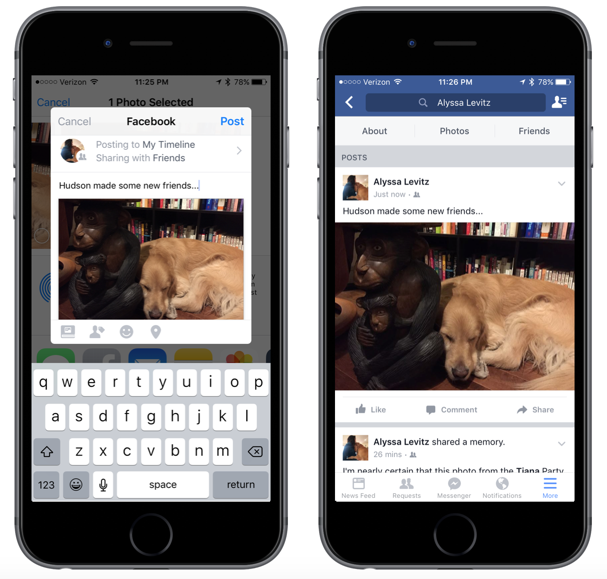

## Content Types

People can share the following kinds of content to Facebook:

- Links - Most content is a URL which references an HTML page. To provide the most relevant information, you should mark up your page with Facebook-specific meta tags. See [A Guide to Sharing for Webmasters](https://developers.facebook.com/docs/sharing/webmasters).

- Photos - Directly upload one or more user-generated photos.

- Videos - Directly upload a user-generated video.

- Multimedia - Directly upload a combination of photos and videos.

- [Open Graph Stories](https://developers.facebook.com/docs/sharing/opengraph) - Use Open Graph actions and objects to create rich stories through a strongly-typed API.


## Builders 

To use the share dialog you firstly create a builder to generate the content of 
the share dialog. There are different builders each representing a different 
content type.


### Links 

When people share links from your app to Facebook, it includes attributes that show up in the post:

- a `contentUrl`, the link to be shared
- a `contentTitle` that represents the title of the content in the link
- a `imageURL`, the URL of thumbnail image that will appear on the post
- a `contentDescription` of the content, usually 2-4 sentences

>
> Note: The title, description, caption and image field of `ShareLinkContentBuilder` have been deprecated
> as of v 4.22.0 of the Facebook SDK. Please take appropriate action to remove usage of them.
>


To share links you will be using the `ShareLinkContentBuilder` to construct
the share content.

For example:

```actionscript
var builder:ShareLinkContentBuilder = new ShareLinkContentBuilder()
	.setContentTitle("FacebookAPI ANE")
	.setContentDescription("This link was shared using the distriqt FacebookAPI ANE" )
	.setContentUrl("https://airnativeextensions.com/extension/com.distriqt.FacebookAPI");
```

Using this builder you can set all of the appropriate parameters for sharing 
a link in your application.


### Photos

People can share photos from your app to Facebook with the Share Dialog or with a custom interface.

- The photos must be less than 12MB in size
- People need the native Facebook for Android or iOS app installed, version 7.0 or higher

To share photos you will be using the `SharePhotoContentBuilder` to construct the
share content.

You can add photos either by:

- bitmap data using the `addBitmap` function
- url using the `addImageUrl` function (Android only)


```actionscript
var bitmapData:BitmapData = ...;

var builder:SharePhotoContentBuilder = new SharePhotoContentBuilder()
	.addBitmap( bitmapData );
```

Or using `addImageUrl`:

```actionscript
var builder:SharePhotoContentBuilder = new SharePhotoContentBuilder()
	.addImageUrl( "https://airnativeextensions.com/images/extensions/icons/ane-facebookapi-icon.png" );
```




### Videos

People using your app can share videos to Facebook with the Share dialog or with your own custom interface:

- The videos must be less than 12MB in size.
- People who share should have Facebook for iOS client installed, version 26.0 or higher.

To share videos you will be using the `ShareVideoContentBuilder` to construct the
share content.

```actionscript
var videoUrl:String = ...;

var builder:ShareVideoContentBuilder = new ShareVideoContentBuilder()
	.setVideoUrl( videoUrl );
```


### Media

People can share a combination of photos and videos from your app to Facebook with the Share Dialog. 

Note the following:

- People need the native Facebook for Android app installed, version 71 or higher.
- Photos must be less than 12MB in size.
- Videos must be less than 12MB in size.
- People can share a maximum of 6 photos and videos at a time.

To share media you will be using the `ShareMediaContentBuilder` to construct the
share content.

