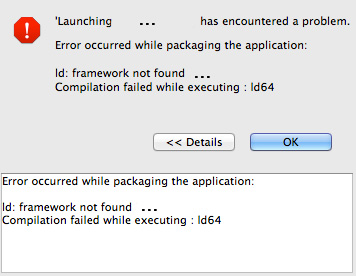
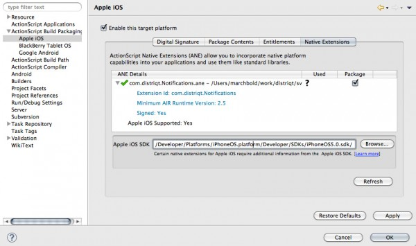

A very common error you may come across is the one shown below, a linker error:

```
ld: framework not found ... 
Compilation failed while executing : ld64
```



The error is simply telling you that the native extension uses some functionality of the phone that is not found in the default SDK that AIR uses to compile against. To resolve this issue you must add in the iOS SDK path into the build packaging options of the iOS platform. Firstly you'll need to acquire the iOS SDK by going to the Apple developer site and downloading xcode.

Then in FlashBuilder you can specify the path in the Apple iOS build packaging options, as below.




If you are using adt to compile (which you'll need to use if you are using Windows) you'll need to specify the platformsdk argument:

```
adt -package -target ipa-app-store \ 
		-provisioning-profile ./myProfile.mobileprovision \ 
		-storetype pkcs12 -keystore ./Certificates.p12 \
		-storepass XXX  \
		myApp.ipa myApp-app.xml Main.swf \
		-extdir ext/ \
		-platformsdk /Developer/Platforms/iPhoneOS.platform/Developer/SDKs/iPhoneOS5.0.sdk/
```