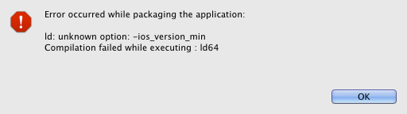

When packaging an iOS AIR application you may encounter the following error:

```
Error occurred while packaging the application:
ld: unknown option: -ios_version_min
Compilation failed while executing: ld64
```

As in the following screenshot:



This error simply indicates that the native extension you are attempting to package requires some features from the iOS SDK or a version greater than the one you are currently using. To remedy this, make sure you are using a recent version of the iOS SDK and correctly including it in your packaging options.

