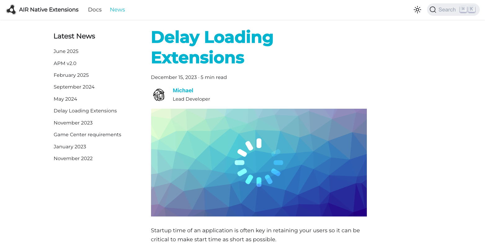
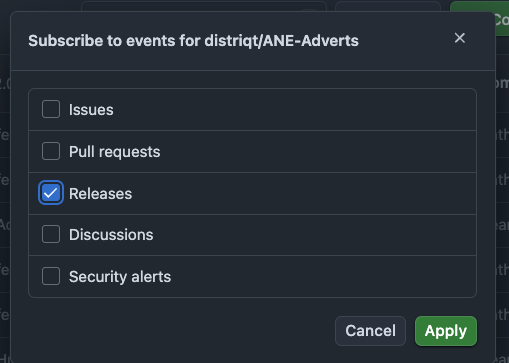
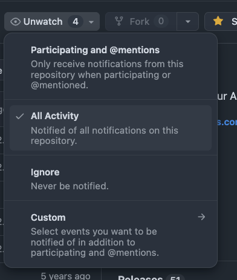

Keeping your development environment up to date is essential for accessing the latest features, improvements, and fixes. We offer several channels to help you stay informed about updates to our extensions and tools. Below you'll find all the ways you can receive notifications and track changes as they happen.


## News

We regularly publish updates and announcements to our [news page](https://docs.airnativeextensions.com/news/) along with tips and information on new features in the AIR SDK. This is the best place to stay informed about new extension releases, important changes, and other relevant news from the team.



If you'd like to receive automatic notifications, you can subscribe to our RSS feed: 
```
https://docs.airnativeextensions.com/news/rss
```

This allows you to get the latest updates delivered directly to your preferred RSS reader as soon as they're published.

We also post these notifications of these posts on the [AIR SDK Discord server](https://discord.gg/6KMBbXcB) and in [GitHub Discussions](https://github.com/airsdk/Adobe-Runtime-Support/discussions/3459) so you can stay up to date through whichever platform suits you best.


## Email

We are planning to start email updates again later in 2025. Stay tuned for more information here.


## GitHub Releases

We use GitHub Releases for all of our extensions as the primary way to manage and distribute updates. This allows developers to easily track changes, access detailed release notes, and refer back to historical versions whenever needed. Each release includes a changelog highlighting new features, bug fixes, and other improvements, along with version-specific details such as dependencies and compatibility notes.

If you'd like to stay informed about new releases, GitHub provides a simple way to subscribe to updates. By "watching" a repository (using the "Watch" button at the top of the repository page and selecting "Custom", then "Releases"), you'll receive email notifications to your GitHub-associated email address whenever a new version is published. This ensures you'll never miss an important update for the extensions you rely on.



Alternatively you can either select "all activity" and you'll get notified on discussions and issues as well as releases:




## Checking for updates

### AIR Package Manager (apm)

You can use the `apm` (AIR Package Manager) command-line tool to check your project for any available package updates. Simply run the `apm outdated` command in your terminal, and it will list all installed packages that have newer versions available. This is a quick and convenient way to ensure your development environment stays up to date with the latest features, improvements, and security fixes.

```
apm outdated
```

This command will check all of the packages in your project and list any available updates.


### Git

You can also use standard Git tools to manually clone, fetch and check status on the repositories if you prefer more direct control over updates. 

However, we generally don't recommend this approach - since there are many extensions, maintaining multiple Git clones can quickly become cumbersome and make it harder to keep everything in sync. For most users, the methods outlined above will provide a more streamlined and reliable way to stay up to date.
