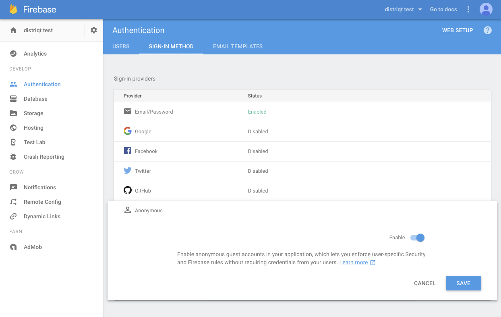

The anonymous provider allows you to sign in a user without requiring any credential,
allowing them to use your application and create an account at a later point. 

They can create a user at a later point by using the `linkWithCredential` functionality 
of the anonymous user.

This method creates a new account in your Firebase Authentication system, except 
in the case where there was already an anonymous user signed in into this app. 
Access the signed-in user with `getCurrentUser()`.

Anonymous users do not require any credential, and are useful in situations 
where you want to persist information about your users before asking them to sign in. 
For example, they may be useful when implementing a signed-out shopping cart in an e-commerce application.

Due to the unauthenticated nature of this kind of user, they are not transferrable across devices. 
In order to allow your app's users to keep their information, ask them to provide 
some other authentication credentials, and link them to the current user with 
`linkWithCredential(AuthCredential)`.


## Enable the Provider

Log in to you Firebase console and go to the **Authentication** section of your application.
Click on **Sign-In Method** and select the **Anonymous** provider and make sure it is enabled as in the screenshot below.




## Sign In Anonymously

Signing the user in anonymously is a simple process of calling the `signInAnonymously()` function and waiting for the result.


```actionscript
if (!FirebaseAuth.service.isSignedIn())
{
	FirebaseAuth.service.addEventListener( 
		FirebaseAuthEvent.SIGNIN_ANONYMOUSLY_COMPLETE, 
		completeHandler );

	FirebaseAuth.service.signInAnonymously();
}
else 
{
	trace( "Already signed in" );
}
```


The event listener is called when there is a result from the sign in call.
If the sign in was successful then you will have a valid signed in user.

A failed result generally indicates that there is an issue with your setup in the Firebase console, 
you can check the `message` for more information to determine the issue.


```actionscript
private function completeHandler( event:FirebaseAuthEvent ):void
{
	trace( "signInAnonymously(): complete: " + event.message );
	if (event.success)
	{
		var user:FirebaseUser = FirebaseAuth.service.getCurrentUser();

		trace( user.identifier );
	}
	else 
	{
		trace( "ERROR::" + event.message );
	}
	FirebaseAuth.service.removeEventListener( 
		FirebaseAuthEvent.SIGNIN_ANONYMOUSLY_COMPLETE, 
		completeHandler );
}
```


You can also listen to the global `FirebaseAuthEvent.AUTHSTATE_CHANGED` event for the success of 
the `signInAnonymously` function, however to correctly process failed events you should use the 
above `FirebaseAuthEvent.SIGNIN_ANONYMOUSLY_COMPLETE` event.
