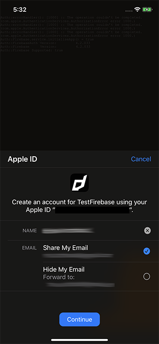
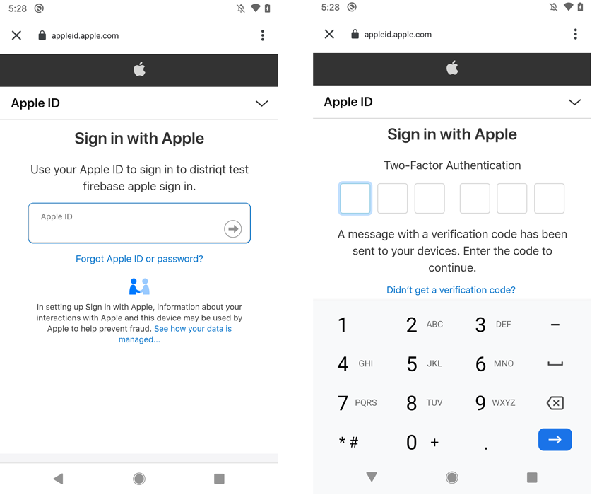

# Sign in with Apple

You can let your users authenticate with Firebase using their Apple ID by using the Firebase SDK and the Apple Sign In extension to carry out the end-to-end OAuth 2.0 sign-in flow.


:::info Important
To sign in with an Apple account, users must:
 
 - Have an Apple ID with two-factor authentication (2FA) enabled.
 - Be signed in to iCloud on an Apple device.

See [How to use Sign in with Apple](https://support.apple.com/en-us/HT210318). You will also need to meet these requirements to test your integration with Sign In with Apple.
:::


## Setup

To sign in users using Apple, first configure Sign In with Apple on Apple's developer site, then enable Apple as a sign-in provider for your Firebase project.

Follow the guide in the:
- [Apple Sign In extension](/docs/applesignin/setup-application)
- or [Firebase documentation](https://firebase.google.com/docs/auth/android/apple#configure-sign-in-with-apple)


## iOS

For iOS devices you will need access to the AppleSignIn extension to perform the "Sign in with Apple".

The iOS authentication with Firebase is a two step process similar to many of the other providers. You will firstly perform the normal Sign in with Apple process and then authenticate with Firebase.


### Sign in with Apple

To perform this step you will need to [add the AppleSignIn extension](/docs/applesignin/add-the-extension).  


Then to perform the actual sign in setup the standard  `AppleSignInOptions` and call `loginWithAppleId()`:

```actionscript
AppleSignIn.instance.addEventListener( AppleSignInErrorEvent.ERROR, errorHandler );
AppleSignIn.instance.addEventListener( AppleSignInEvent.SUCCESS, successHandler );

var options:AppleSignInOptions = new AppleSignInOptions()
        .setRequestedScopes([
                AppleSignInScopes.FULL_NAME,
                AppleSignInScopes.EMAIL
                            ]);

AppleSignIn.instance.loginWithAppleId( options );

function successHandler( event:AppleSignInEvent ):void
{
    // Continue to Authenticate with Firebase
}

function errorHandler( event:AppleSignInErrorEvent ):void
{
    // Handle the error as required by your application
    trace( "errorHandler(): [" + event.errorID + "] :: " + event.text  );
}
```




### Authenticate with Firebase

Once you have successfully performed the Sign in with Apple you will need to use the Apple Id credentials to construct a Firebase `OAuthCredential`. You will need the ID Token and the raw nonce from the success event.

>
> It is important to note that the credentials returned from the Apple Sign In ANE are base64 encoded so you will need to decode them before passing to Firebase
>


```actionscript
var identityToken:String = Base64.decode( event.appleIdCredential.identityToken );
var rawNonce:String = event.rawNonce;
```

Then use these values to create the `OAuthCredential` using `apple.com` as the provider id:

```actionscript
var credential:OAuthCredential =
        OAuthProvider.getCredential( "apple.com" )
            .setIdTokenWithRawNonce(
                    identityToken,
                    rawNonce
            );
```

Once you have created the `OAuthCredential` object you call `signInWithCredential()` passing in this `credential` object:


```actionscript
var success:Boolean = FirebaseAuth.service.signInWithCredential( credential );
```

This may return `false` if your `credential` was invalid. 


If successful you will receive the `FirebaseAuthEvent.SIGNIN_WITH_CREDENTIAL_COMPLETE` which will indicate the success of the sign in:

```actionscript
FirebaseAuth.service.addEventListener( FirebaseAuthEvent.SIGNIN_WITH_CREDENTIAL_COMPLETE, signInWithCredential_completeHandler );

FirebaseAuth.service.signInWithCredential( credential );


function signInWithCredential_completeHandler( event:FirebaseAuthEvent ):void
{
    trace("signInWithCredential_completeHandler(): " + event.success );
}
```


## Android 


The AppleSignIn extension is not required for Android, the parts that we implemented in that ANE are replicated by Firebase.  The easiest way to authenticate your users with Firebase using their Apple accounts is to handle the entire sign-in flow with the Firebase Android SDK.

To handle the sign-in flow with the Firebase Android SDK, follow these steps:

1. Construct an instance of the `OAuthProvider`

```actionscript
var provider:OAuthProvider = new OAuthProvider( "apple.com" );
```


2. **Optional**: Specify additional OAuth 2.0 scopes beyond the default that you want to request from the authentication provider using `setScopes()`:

```actionscript
var provider:OAuthProvider = new OAuthProvider( "apple.com" )
        .setScopes([ "email", "name" ]);
```


3. **Optional**: If you want to display Apple's sign-in screen in a language other than English, set the locale parameter.

```actionscript
var provider:OAuthProvider = new OAuthProvider( "apple.com" )
        .setScopes([ "email", "name" ])
        .addCustomParameter("locale", "fr")
;
```

4. Authenticate with Firebase using the OAuth provider object by calling `startSignInWithProvider` and awaiting the `FirebaseAuthEvent.SIGNIN_WITH_PROVIDER_COMPLETE`. Note that unlike other FirebaseAuth operations, this will take control of your UI by opening a Custom Chrome Tab. 

```actionscript
FirebaseAuth.service.startSignInWithProvider( provider );
```

This completes with the `FirebaseAuthEvent.SIGNIN_WITH_PROVIDER_COMPLETE` event:


```actionscript
FirebaseAuth.service.addEventListener(
        FirebaseAuthEvent.SIGNIN_WITH_PROVIDER_COMPLETE,
        startSignInWithProvider_completeHandler
);

FirebaseAuth.service.startSignInWithProvider( provider );

function startSignInWithProvider_completeHandler( event:FirebaseAuthEvent ):void
{
    trace( "startSignInWithProvider_completeHandler():complete:" + event.success );
}
```




## Next Steps

Once you have completed the authentication with Firebase ou should expect the normal `FirebaseAuthEvent.AUTHSTATE_CHANGED` event indicating that a user was authenticated and then you will be able to retrieve the user's details using the standard `getCurrentUser()` where one of the providers will be the Apple details.

```actionscript
var user:FirebaseUser = FirebaseAuth.service.getCurrentUser();
if (user != null)
{
    log( "identifier:  " + user.identifier );
    log( "displayName: " + user.displayName );
    log( "email:       " + user.email );
    
    for each (var info:UserInfo in user.providers)
    {
        log( "------------------" );
        log( "\tprovider:    " + info.providerId );
        log( "\tidentifier:  " + info.identifier );
        log( "\tdisplayName: " + info.displayName );
        log( "\temail:       " + info.email );
        log( "\tphone:       " + info.phoneNumber );
    }
}
```

Unlike other providers supported by Firebase Auth, Apple does not provide a photo URL.

Also, when the user chooses not to share their email with the app, Apple provisions a unique email address for that user (of the form xyz@privaterelay.appleid.com), which it shares with your app. If you configured the private email relay service, Apple forwards emails sent to the anonymized address to the user's real email address.

Apple only shares user information such as the display name with apps the first time a user signs in. Usually, Firebase stores the display name the first time a user signs in with Apple, which you can get with the above. However, if you previously used Apple to sign a user in to the app without using Firebase, Apple will not provide Firebase with the user's display name.


## Example

The following example demonstrates how to use the above concepts across both Android and iOS using the auth state changed event to listen for the user authentication.

```actionscript
FirebaseAuth.service.addEventListener( FirebaseAuthEvent.AUTHSTATE_CHANGED, authState_changedHandler );

if (FirebaseAuth.service.implementation == "Android")
{
    FirebaseAuth.service.addEventListener(
            FirebaseAuthEvent.SIGNIN_WITH_PROVIDER_COMPLETE,
            startSignInWithProvider_completeHandler
    );
    
    var provider:OAuthProvider = new OAuthProvider( "apple.com" )
            .setScopes([ "email", "name" ])
    ;
    
    FirebaseAuth.service.startSignInWithProvider( provider );
}
else if (FirebaseAuth.service.implementation == "iOS")
{
    AppleSignIn.instance.addEventListener( AppleSignInErrorEvent.ERROR, appleSignIn_errorHandler );
    AppleSignIn.service.addEventListener( AppleSignInEvent.SUCCESS, appleSignIn_successHandler );
    
    var options:AppleSignInOptions = new AppleSignInOptions()
            .setRequestedScopes([
                                    AppleSignInScopes.FULL_NAME,
                                    AppleSignInScopes.EMAIL
                                ]);
    
    AppleSignIn.service.loginWithAppleId( options );
}


function startSignInWithProvider_completeHandler( event:FirebaseAuthEvent ):void
{
    // End of the Android sign in process
    trace( "startSignInWithProvider_completeHandler():complete:" + event.success );
}


function appleSignIn_successHandler( event:AppleSignInEvent ):void
{
    var credential:OAuthCredential =
                OAuthProvider.getCredential( "apple.com" )
                    .setIdTokenWithRawNonce(
                            Base64.decode( event.appleIdCredential.identityToken ),
                            event.rawNonce
                    );
    
    FirebaseAuth.service.addEventListener( 
            FirebaseAuthEvent.SIGNIN_WITH_CREDENTIAL_COMPLETE, 
            signInWithCredential_completeHandler 
    );
    
    FirebaseAuth.service.signInWithCredential( credential );
}

function appleSignIn_errorHandler( event:AppleSignInErrorEvent ):void
{
    trace( "errorHandler(): [" + event.errorID + "] :: " + event.text  );
}


function signInWithCredential_completeHandler( event:FirebaseAuthEvent ):void
{
    // End of the iOS sign in process
    trace("signInWithCredential_completeHandler(): " + event.success );
}


function authState_changedHandler( event:FirebaseAuthEvent ):void
{
    // This will be fired on both iOS and Android when the user is authenticated 
    trace( "auth state changed: "+FirebaseAuth.service.isSignedIn() );
}
```


