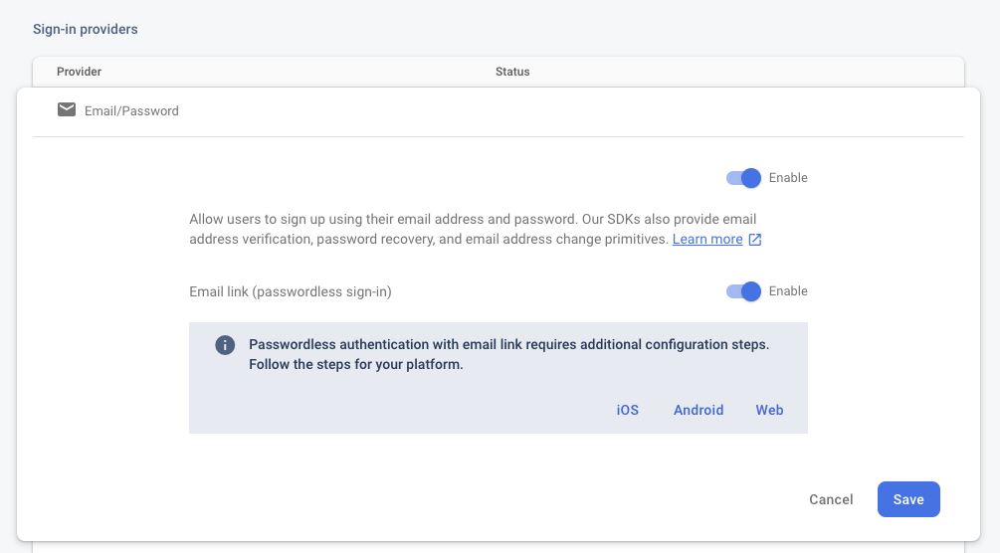

You can use Firebase Authentication to sign in a user by sending them an email containing a link, 
which they can click to sign in. In the process, the user's email address is also verified.

There are numerous benefits to signing in by email:

- Low friction sign-up and sign-in.
- Lower risk of password reuse across applications, which can undermine security of even well-selected passwords.
- The ability to authenticate a user while also verifying that the user is the legitimate owner of an email address.
- A user only needs an accessible email account to sign in. No ownership of a phone number or social media account is required.
- A user can sign in securely without the need to provide (or remember) a password, which can be cumbersome on a mobile device.
- An existing user who previously signed in with an email identifier (password or federated) can be upgraded to sign in with just the email. For example, a user who has forgotten their password can still sign in without needing to reset their password.

## Enable Email Link sign-in

To sign in users by email link, you must first enable the Email provider and Email link sign-in method for your Firebase project:

1. In the Firebase console, open the Auth section.
2. On the Sign in method tab, enable the Email/Password provider. Note that email/password sign-in must be enabled to use email link sign-in.
3. In the same section, enable Email link (passwordless sign-in) sign-in method.
4. Click Save.




## Send an authentication link

To initiate the authentication flow, present the user with an interface that prompts the user 
to provide their email address and then call `sendSignInLinkToEmail()` to request that 
Firebase send the authentication link to the user's email.

1. Construct the ActionCodeSettings object, which provides Firebase with instructions on how to construct the email link.  Set the following fields:
	- `url`: The deep link to embed and any additional state to be passed along. The link's domain has to be whitelisted in the Firebase Console list of authorized domains, which can be found by going to the Sign-in method tab (Authentication -> Sign-in method). The link will redirect the user to this URL if the app is not installed on their device and the app was not able to be installed.
	- `androidPackageName` and `IOSBundleId`: The apps to use when the sign-in link is opened on an Android or iOS device. Learn more on how to configure Firebase Dynamic Links to open email action links via mobile apps.
	- `handleCodeInApp`: Set to `true`. The sign-in operation has to always be completed in the app unlike other out of band email actions (password reset and email verifications). This is because, at the end of the flow, the user is expected to be signed in and their Auth state persisted within the app.

2. Ask the user for their email.

3. Send the authentication link to the user's email, and save the user's email in case the user completes the email sign-in on the same device.


```actionscript
var email:String = "some@email.com";

var actionCodeSettings:ActionCodeSettings = new ActionCodeSettings()
	// URL you want to redirect back to. The domain (www.example.com) for this
	// URL must be whitelisted in the Firebase Console.
	.setUrl( "https://www.example.com/finishSignUp?cartId=1234" )
	.setHandleCodeInApp( true )
	.setIOSBundelId( "com.example.ios" )
	.setAndroidPackageName( 
		"com.example.android", 
		true,  /* installIfNotAvailable */
		"1" /* minimumVersion */ );
		
FirebaseAuth.service.sendSignInLinkToEmail( Config.email, actionCodeSettings );
```

This process will dispatch a complete event when the process was completed with a success flag similar to other events in this extension:

```actionscript
FirebaseAuth.service.addEventListener(
	FirebaseAuthEvent.SEND_SIGNIN_LINK_TO_EMAIL_COMPLETE,
	sendSignInLinkToEmail_completeHandler );


function sendSignInLinkToEmail_completeHandler( event:FirebaseAuthEvent ):void
{
	trace( "sendSignInLinkToEmail():complete:" + event.success );
}
```


At this point the user will need to check their email and click on the link in the email.


### URL

For the URL we generally suggest you use your Firebase app url (`https://PROJECT_ID.firebaseapp.com`). This normally can be found by checking the *Authorized Domains* in the Firebase Console under *Authentication > Sign in Method*

Using this method and adding the Dynamic Links extension simplifies the development and integration required. 

This guide will assume this approach however you can use whatever approach suits you needs to handle the url redirection.


## Complete sign in with the email link


### Add Dynamic Links

Firebase Auth uses Firebase Dynamic Links when sending a link that is meant to be opened in a mobile application. In order to use this feature, Dynamic Links must be configured in the Firebase Console.

Follow the guide to add the Dynamic Links extension to your application:

- [DynamicLinks](../../dynamiclinks/add-the-extension)


Now you can listen for the user to click on the link in the email 

```actionscript
FirebaseDynamicLinks.service.addEventListener( 
	DynamicLinkEvent.RECEIVED, 
	dynamicLink_receivedHandler );

function dynamicLink_receivedHandler( event:DynamicLinkEvent ):void
{
	trace( "dynamicLink_receivedHandler(): " + event.link );

	// This could be the email link 

}
```


### Verify link and sign in

After you receive the link as described above, verify that it is meant for email link authentication and complete the sign in.

You can check if a link is a "sign in with email link" by using the `isSignInWithEmailLink()` function:

```actionscript
if (FirebaseAuth.service.isSignInWithEmailLink( link ))
{
	// This is a "sign in with email link"
}
```

You then can sign in the user using their email and the email link by calling the `signInWithEmailLink()` function:

```actionscript
if (FirebaseAuth.service.isSignInWithEmailLink( link ))
{
	// Initiate the sign in process
	FirebaseAuth.service.signInWithEmailLink( email, link );
}
```

The sign in process will dispatch an event once complete:


```actionscript
FirebaseAuth.service.addEventListener(
	FirebaseAuthEvent.SIGNIN_WITH_EMAILLINK_COMPLETE,
	signInWithEmailLink_completeHandler );

function signInWithEmailLink_completeHandler( event:FirebaseAuthEvent ):void
{
	trace( "signInWithEmailLink():complete:" + event.success );
}
```

Of course you can use your global `FirebaseAuthEvent.AUTHSTATE_CHANGED` to listen for sign in success as well as this handler.


## Differentiating email/password from email link


In case you support both password and link-based sign in with email, to differentiate the method of sign in for a password/link user, use `fetchSignInMethodsForEmail()`. This is useful for identifier-first flows where the user is first asked to provide their email and then presented with the method of sign-in:


```actionscript
FirebaseAuth.service.addEventListener(
		FirebaseAuthMethodsEvent.FETCH_SIGNIN_METHODS_COMPLETE,
		fetchSignInMethodsForEmail_completeHandler );

FirebaseAuth.service.fetchSignInMethodsForEmail( Config.email );
		
function fetchSignInMethodsForEmail_completeHandler( event:FirebaseAuthMethodsEvent ):void
{
	trace( "fetchSignInMethodsForEmail():complete:" + event.success );
	if (event.methods != null)
	{
		for each (var method:String in event.methods)
		{
			if (EmailAuthCredential.EMAIL_LINK_SIGN_IN_METHOD == method)
			{
				// User can sign in with email/link
			}
			else if (EmailAuthCredential.EMAIL_PASSWORD_SIGN_IN_METHOD == method)
			{
				// User can sign in with email/password
			}
		}
	}
			
}
```

Note: email/password and email/link are considered the same `EmailAuthProvider` (same `PROVIDER_ID`) with different methods of sign-in.

