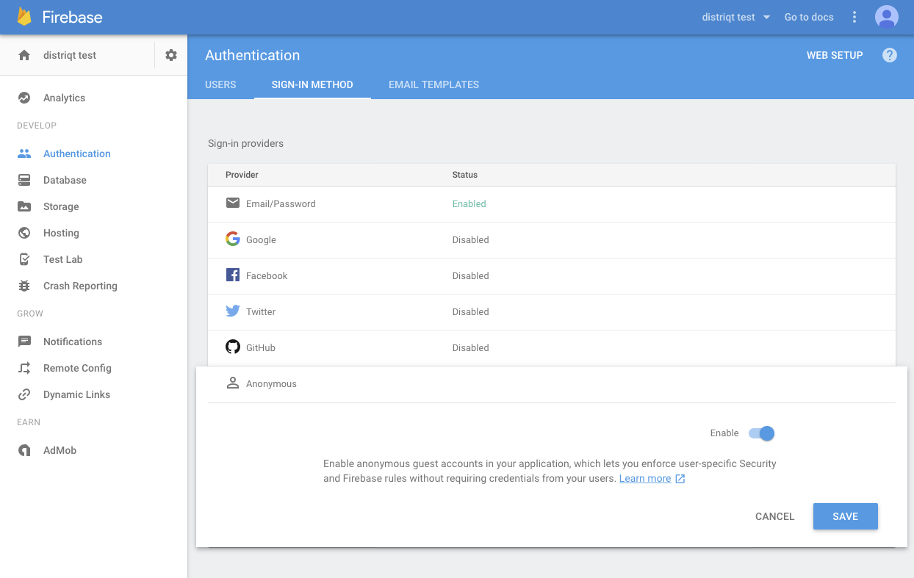

The Email/Password provider allows you to sign in a user with an email address and password.

This is the simplest form of user authentication provided by the Firebase platform.


## Enable the Provider

Log in to you Firebase console and go to the **Authentication** section of your application.
Click on **Sign-In Method** and select the **Email/Password** provider and make sure it is enabled 
as in the screenshot below.




## Sign up new users

Creating a user account requires you to create functionality to gather their 
email and password and then call the `createUserWithEmailAndPassword` function.

This function tries to create a new user account with the given email address and password. 
If successful, it also signs the user in into the app.

Access the signed-in user with `getCurrentUser()`.

Upon successful completion, this operation triggers an `FirebaseAuthEvent.AUTHSTATE_CHANGED` event 
and it will trigger a `FirebaseAuthEvent.CREATE_USER_WITH_EMAIL_COMPLETE` on success or failure.

```actionscript
FirebaseAuth.service.addEventListener( 
	FirebaseAuthEvent.CREATE_USER_WITH_EMAIL_COMPLETE,
	createUserWithEmailAndPassword_completeHandler );

FirebaseAuth.service.createUserWithEmailAndPassword( email, password );
```

The following handler can be used to determine the success or failure of the call.

```actionscript
private function createUserWithEmailAndPassword_completeHandler( event:FirebaseAuthEvent ):void
{
	trace( "createUserWithEmailAndPassword(): complete: " + event.success +"::"+event.message );
	
	FirebaseAuth.service.removeEventListener( 
		FirebaseAuthEvent.CREATE_USER_WITH_EMAIL_COMPLETE,
		createUserWithEmailAndPassword_completeHandler );
}
```

Of course you can use your global `FirebaseAuthEvent.AUTHSTATE_CHANGED` to listen for sign in success 
as well as this handler.


## Sign in existing users

Similarly to the creation process you will need to gather the user's email and password and 
then call the `signInWithEmailAndPassword` function.

This function tries to sign in a user with the given email address and password, and does
not attempt to create the user if it does not exist.

Access the signed-in user with `getCurrentUser()`.

Upon successful completion, this operation triggers an `FirebaseAuthEvent.AUTHSTATE_CHANGED` event 
and it will trigger a `FirebaseAuthEvent.SIGNIN_WITH_EMAIL_COMPLETE` on success or failure.


```actionscript
FirebaseAuth.service.addEventListener( 
	FirebaseAuthEvent.SIGNIN_WITH_EMAIL_COMPLETE,
	signInWithEmailAndPassword_completeHandler );

FirebaseAuth.service.signInWithEmailAndPassword( email, password );
```

The following handler can be used to determine the success or failure of the call.

```actionscript
private function signInWithEmailAndPassword_completeHandler( event:FirebaseAuthEvent ):void
{
	trace( "signInWithEmailAndPassword(): complete: " + event.success +"::"+event.message );

	FirebaseAuth.service.removeEventListener( 
		FirebaseAuthEvent.SIGNIN_WITH_EMAIL_COMPLETE,
		signInWithEmailAndPassword_completeHandler );

	if (event.success)
	{
		var user:FirebaseUser = FirebaseAuth.service.getCurrentUser();
		trace( user.displayName );
	}
}
```

Of course you can use your global `FirebaseAuthEvent.AUTHSTATE_CHANGED` to listen for sign in success 
as well as this handler.
