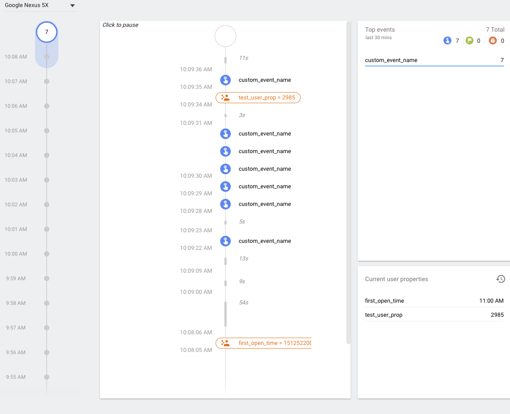

Once you have configured the core Firebase project you can use the analytics features in your AIR application.


## Log Events


```actionscript
var event:EventObject = new EventObject();

event.name = EventObject.ADD_TO_CART;
event.params[Params.PRICE] = 1.99;
event.params[Params.CURRENCY] = "USD";
event.params[Params.VALUE] = 88;

Firebase.service.analytics.logEvent( event );
```


## Set User Properties

You can set a user id to identify your users.

```actionscript
Firebase.service.analytics.setUserID( userId ); 
```


You can set user properties to describe the users of your application and then use these properties to filter your reports.

```actionscript
Firebase.service.analytics.setUserProperty( name, value );
```


## Debugging 

You can enable the debug mode for analytics which will send events almost immediately to the Debug View on the console:




### Android

You can debug your analytics events using `adb` and the Debug View in the firebase console.

Firstly make sure you've [enabled developer mode on your Android device](/docs/tutorials/android-device-debugging)

Open up a terminal/console and use adb to enable debug analytic events:

```
adb shell setprop debug.firebase.analytics.app APPLICATION_PACKAGE
``` 

eg

```
adb shell setprop debug.firebase.analytics.app air.com.distriqt.test
```

Additionally you can check the logs to see if there are any errors. It helps to set logging to verbose:

```
adb shell setprop log.tag.FA VERBOSE
```

Then restart your application and watch the logs:

```
adb logcat
```

You should see something like:

```
12-06 10:16:45.251 28709 28709 I FA      : App measurement is starting up, version: 11020
12-06 10:16:45.251 28709 28709 I FA      : To enable debug logging run: adb shell setprop log.tag.FA VERBOSE
12-06 10:16:45.258 28709 28709 V FA      : Collection enabled
12-06 10:16:45.259 28709 28709 V FA      : App package, google app id: air.com.distriqt.test, 1:XXXXXXXXXXXXX:android:XXXXXXXXXXXXXX
12-06 10:16:45.259 28709 28709 I FA      : Faster debug mode event logging enabled. To disable, run:
12-06 10:16:45.259 28709 28709 I FA      :   adb shell setprop debug.firebase.analytics.app .none.
12-06 10:16:45.259 28709 28709 D FA      : Debug-level message logging enabled
12-06 10:16:45.264 28709 28709 V FA      : Registered activity lifecycle callback
```

Check the app id is correct and watch for any errors when logging events.


### iOS

With iOS you have to launch your application with a specific flag. This is not possible using AIR SDK, however using the *libimobiledevice* tools it is possible to launch an application on your device with this flag.

Firstly you will need to install these tools. 

- https://www.libimobiledevice.org/

You can access installers in various locations but we suggest using homebrew:

```
brew install --HEAD usbmuxd
brew install --HEAD libimobiledevice  
brew install --HEAD ideviceinstaller  
```

> We found you have to use the `HEAD` version to get it to work currently 


Then to launch the application with the debugging `FIRAnalyticsDebugEnabled` flag:

```
idevicedebug run "com.distriqt.test" "-FIRAnalyticsDebugEnabled"
```

> Replace `com.distriqt.test` with your application id


To later disable the debugging outputs, launch the application with the `noFIRAnalyticsDebugEnabled` flag:

```
idevicedebug run "com.distriqt.test" "-noFIRAnalyticsDebugEnabled"
```

> 
> Note: these flags have changed from the previous version of `FIRDebugEnabled` and `FIRDebugDisabled`
>