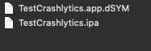

On Android your crash logs will appear in the dashboard in around 5 minutes however you will not see your iOS logs unless you upload the debugging information file generated for your iOS `IPA`. 

All the debug information for your iOS application is contained in a `dSYM` file. 

Firebase Crashlytics automatically processes your debug symbol (`.dSYM`) files to give you deobfuscated, human-readable crash reports. You can no longer manually upload dSYMs through the [console](https://console.firebase.google.com/) and instead have to upload them using a script.

:::caution
If you don't upload a `dSYM` for each version of your application there will be a warning displayed about missing dSYMs in the console and detailed information for any crashes of that version will not be shown in the console.
:::


## Generating a dSYM for your AIR application

`dSYM` directory should be generated by AIR alongside your IPA. If not you may have to check your applications build setup and environment to ensure AIR can generate the debugging symbols.





:::warning
Currently the `dSYM` directory will only be produced by the AIR SDK on macOS build systems. We encourage you to use a macOS machine to build your iOS applications.
:::


## Uploading 

Once you have located your `dSYM` you will need to use the `upload-symbols` command line utility to upload the data to Firebase.

Copy the `scripts/upload-symbols` utility from the repository to a location on your machine and open a Terminal in that location. Then run the following command:

```
./upload-symbols -gsp PATH/TO/YOUR/GoogleService-Info.plist -p ios PATH/TO/YOUR/APPNAME.app.dSYM
```

You will need to pass the `GoogleService-Info.plist` location to identify your application and the path to your `dSYM`. 

