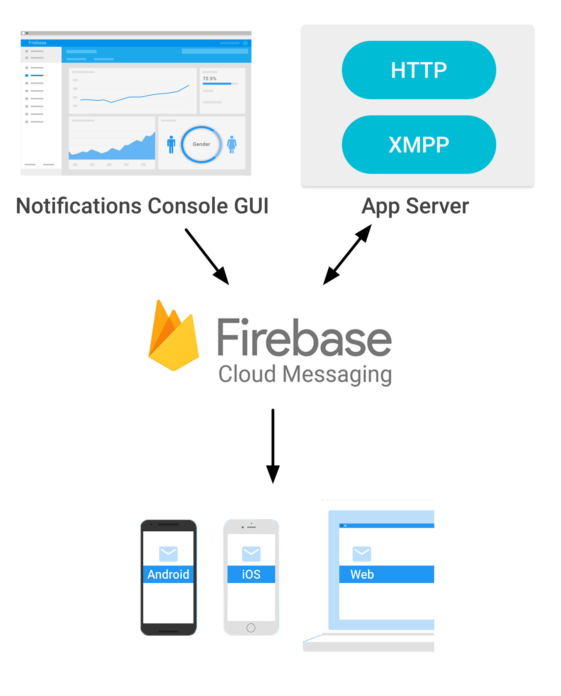

Firebase Cloud Messaging (FCM) is a cross-platform messaging solution that lets you reliably deliver messages at no cost.

Using FCM, you can notify a client app that new email or other data is available to sync. 
You can send notification messages to drive user reengagement and retention. 
For use cases such as instant messaging, a message can transfer a payload of up to 4KB to a client app.

FCM is the new version of GCM under the Firebase brand. 
It inherits GCM’s core infrastructure, with new SDKs to make Cloud Messaging development easier.

Benefits of upgrading to FCM SDK include:

- Simpler client development. You no longer have to write your own registration or subscription retry logic.
- An out-of-the-box notification solution. You can use Firebase Notifications, a serverless notifications solution with a web console that lets anyone send notifications to target specific audiences based on Firebase Analytics insights.

[https://firebase.google.com/docs/cloud-messaging/](https://firebase.google.com/docs/cloud-messaging/)

## Key capabilities

| | |
|---|---|
| Send notification messages or data messages | Send notification messages that are displayed to your user. Or send data messages and determine completely what happens in your application code. |
| Versatile message targeting                 | Distribute messages to your client app in any of three ways — to single devices, to groups of devices, or to devices subscribed to topics. |
| Send messages from client apps              | Send acknowledgments, chats, and other messages from devices back to your server over FCM’s reliable and battery-efficient connection channel. |

## How does it work? 

>
> An FCM implementation includes an app server that interacts with FCM via HTTP or XMPP protocol, and a client app. 
> You can compose and send messages using the app server or the Notifications console.
> 
> Firebase Notifications is built on Firebase Cloud Messaging and shares the same FCM SDK 
> for client development. For testing or for sending marketing or engagement messages with 
> powerful built-in targeting and analytics, you can use Notifications. 
> For deployments with more complex messaging requirements, FCM is the right choice.
>

## AIR Integration

Our highly tested Push Notifications ANE includes Firebase Cloud Messaging and Firebase In-App Messaging.

We chose to integrate it into our existing ANE to allow you to easily switch between push notification services, including APNS, GCM, FCM and OneSignal.

This means that you can easily integrate FCM in your application using that extension in combination with the core Firebase ANE. 
The core and config Firebase ANEs are required to include the neccessary SDK and configure your application for Firebase. 

Follow the guide in the Push Notifications ANE wiki to get started with Firebase Cloud Messaging:

- Get the [Push Notifications ANE](https://airnativeextensions.com/extension/com.distriqt.PushNotifications)
- Follow the FCM setup guide in the [Push Notifications documentation](https://docs.airnativeextensions.com/docs/pushnotifications/firebase-cloud-messaging/) 

