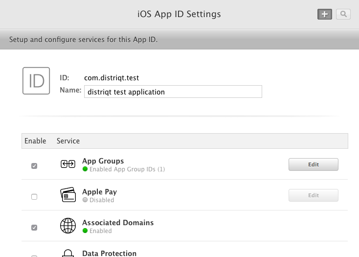

>
> **DEPRECATED**
>
> Please note that the Invites functionality has been removed from the latest Firebase SDK. 
> You should update your applications to use dynamic links directly in combination with your own share functionality.
> You can use the [Share ANE](https://airnativeextensions.com/extension/com.distriqt.Share) as a starting point.
>
> This documentation is only for legacy reference.
>

## Required Extensions

You should have been through the setup of the Firebase Core before attempting to proceed with Invites.

Make sure you have added all the extensions required for the Firebase Core extension as outlined [here](../core/add-the-extensions.mdx).

The Invites extension is not compatible with the Dynamic Links extension. You should use one or the other.
Invites is built on top of the Firebase dynamic links functionality so the invites extension includes all the dynamic link functionality as well as the invites functionality.


### Firebase Invites

The only required additional ANE is the Invites ANE located in this repository:

- `com.distriqt.firebase.Invites` : https://github.com/distriqt/ANE-Firebase

This ANE contains all the required libraries for the main Firebase Invites functionality.

You cannot use the Dynamic Links ANE with this ANE. Instead the functionality of the Dynamic Links ANE is replicated in this ANE.

See the notes on [dynamic links](dynamic-links.md).


## Extension IDs

The following should be added to your `extensions` node in your application descriptor to identify all the required ANEs in your application:

```xml
<extensions>
    <extensionID>com.distriqt.Firebase</extensionID>
    <extensionID>com.distriqt.firebase.Invites</extensionID>
	
    <extensionID>com.distriqt.Core</extensionID>

    <extensionID>com.distriqt.playservices.Base</extensionID>
    <extensionID>com.distriqt.playservices.AdsIdentifier</extensionID>

    <extensionID>com.google.protobuflite</extensionID>
    <extensionID>com.google.firebase.core</extensionID>

    <extensionID>androidx.core</extensionID>
	
	<extensionID>com.distriqt.CustomResources</extensionID>
</extensions>
```


---

### Google Play Services

This ANE requires usage of certain aspects of the Google Play Services client library. 
The client library is available as a series of ANEs that you add into your applications packaging options. 
Each separate ANE provides a component from the Play Services client library and are used by different ANEs. 
These client libraries aren't packaged with this ANE as they are used by multiple ANEs and separating them 
will avoid conflicts, allowing you to use multiple ANEs in the one application.

This ANE requires the following Google Play Services in addition to the ones required by the [Firebase Core](../core/add-the-extensions.mdx#add-the-extension):

- [`com.distriqt.playservices.AppInvite.ane`](https://github.com/distriqt/ANE-GooglePlayServices/raw/master/lib/com.distriqt.playservices.AppInvite.ane)

You must include the above native extensions in your application along with this extension, 
and you need to ensure they are packaged with your application.

You can access the Google Play Services client library extensions here: [https://github.com/distriqt/ANE-GooglePlayServices](https://github.com/distriqt/ANE-GooglePlayServices).


---

### Google Identity

On iOS, Firebase Invites requires you to login your users using their Google Identity. 

This means you will need to have integrated the [Google Identity ANE](https://airnativeextensions.com/extension/com.distriqt.GoogleIdentity) in your application in order to support iOS.

Android does not require this. 

Without the Google Identity ANE this extension will not work on iOS. 


---

## Android Manifest Additions

As with plain deep links, you must add an intent filter to the activity that handles deep links for your app. 
The intent filter should catch deep links of your domain, since the Dynamic Link will redirect to your domain 
if your app is installed. This is required for your app to receive the Dynamic Link data after it is installed 
from the Play Store. In AndroidManifest.xml:


```xml
<intent-filter>
	<action android:name="android.intent.action.VIEW"/>
	<category android:name="android.intent.category.DEFAULT"/>
	<category android:name="android.intent.category.BROWSABLE"/>

	<data android:scheme="http" android:host="airnativeextensions.com" />
	<data android:scheme="https" android:host="airnativeextensions.com" />
	<data android:scheme="distriqt" android:host="appinvite" />
</intent-filter>
```

This intent filter should be added directly after the `<application>` tag in your manifest additions. 
(Note: This is not the main `<application>` tag in your AIR application descriptor but the one inside 
your manifest additions!) 

When users open a link to the scheme and host you specify, your app will start an activity to handle the link.

For more details on these fields and how to handle other types of App Links you can
read the official Android documentation on [Handling App Links](https://developer.android.com/training/app-links/index.html)


You will also need to add the following activity:


```xml
<activity
	android:name="com.google.android.gms.appinvite.PreviewActivity"
	android:exported="true"
	android:theme="@style/Theme.AppInvite.Preview" >
	<intent-filter>
		<action android:name="com.google.android.gms.appinvite.ACTION_PREVIEW" />

		<category android:name="android.intent.category.DEFAULT" />
	</intent-filter>
</activity>
```

For example:

```xml
<android>
	<manifestAdditions><![CDATA[
		<manifest android:installLocation="auto">
			<uses-permission android:name="android.permission.INTERNET"/>
			
			<!-- OTHER PERMISSIONS / REQUIREMENTS -->

			<application>

				<intent-filter>
					<action android:name="android.intent.action.VIEW"/>
					<category android:name="android.intent.category.DEFAULT"/>
					<category android:name="android.intent.category.BROWSABLE"/>

					<data android:scheme="http" android:host="airnativeextensions.com" />
	                <data android:scheme="https" android:host="airnativeextensions.com" />
                    <data android:scheme="distriqt" android:host="appinvite" />
				</intent-filter>


				<activity
					android:name="com.google.android.gms.appinvite.PreviewActivity"
					android:exported="true"
					android:theme="@style/Theme.AppInvite.Preview" >
					<intent-filter>
						<action android:name="com.google.android.gms.appinvite.ACTION_PREVIEW" />

						<category android:name="android.intent.category.DEFAULT" />
					</intent-filter>
				</activity>
			

				<!-- OTHER ADDITIONS -->


			</application>
		</manifest>
	]]></manifestAdditions>
</android>
```


## iOS 

Ensure that your app's App Store ID and your Apple Developer Team ID is specified in your app's settings. To view and edit your app's settings, go to your Firebase project's Settings page and select your iOS app.

You can confirm that your Firebase project is properly configured to use Dynamic Links in your iOS app by opening the following URL (replacing `app_code` with your app code):

```
https://app_code.app.goo.gl/apple-app-site-association
```

If your app is connected, the apple-app-site-association file contains a reference to your app's App Store ID and bundle ID. For example:

```
{"applinks":{"apps":[],"details":[{"appID":"1234567890.com.example.ios","paths":["/*"]}]}}
```

If the details field is empty, double-check that you specified your Team ID.


### Developer Console


Ensure your application identifier in the iOS developer member center has enabled "Associated Domains".
Enabling Associated Domains allows an app to be associated with a specified domain for specified services
such as accessing Safari saved passwords and activity continuation.

To do this, log into the member center and open your [App IDs](https://developer.apple.com/account/ios/identifier/bundle)

Select your App ID and select "Edit". You need to enable the "Associated Domains" service as below:



>
> Note: You will need to regenerate and download your provisioning profiles after making this change. 
>


### Info Additions and Entitlements

You will firstly need to add any custom url scheme to your info additions, by adding
the following and replacing `APP_SCHEME` with your applications custom url scheme:

```xml
<key>CFBundleURLTypes</key>
<array>
	<dict>
		<key>CFBundleURLSchemes</key>
		<array>
			<string>APP_SCHEME</string>
		</array>
	</dict>
</array>
```

You need to add the associated domain to your iOS Entitlements section, replacing 
`APP_CODE` below with your Dynamic Links domain.

```xml
<key>com.apple.developer.associated-domains</key>
<array>
	<string>applinks:APP_CODE.app.goo.gl</string>
</array>
```

For example:

```xml
<iPhone>
	<InfoAdditions><![CDATA[

		<key>CFBundleURLTypes</key>
		<array>
			<dict>
				<key>CFBundleURLSchemes</key>
				<array>
					<string>distriqt</string>
				</array>
			</dict>
		</array>

	]]></InfoAdditions>
	<requestedDisplayResolution>high</requestedDisplayResolution>
	<Entitlements><![CDATA[
		
		<key>com.apple.developer.associated-domains</key>
		<array>
			<string>applinks:abc123.app.goo.gl</string>
		</array>

	]]></Entitlements>
</iPhone>
```


