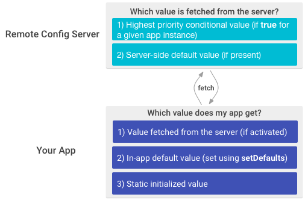

## Remote Config

>
> Change the behavior and appearance of your app without publishing an app update.
>
> Firebase Remote Config is a cloud service that lets you change the behavior and appearance of your app 
> without requiring users to download an app update. When using Remote Config, you create in-app default 
> values that control the behavior and appearance of your app. Then, you can later use the Firebase 
> console to override in-app default values for all app users or for segments of your user base. Your app 
> controls when updates are applied, and it can frequently check for updates and apply them with a 
> negligible impact on performance.
> 

[https://firebase.google.com/docs/remote-config/](https://firebase.google.com/docs/remote-config/)

## Key capabilities

| | |
|---|---|
| Quickly roll out changes to your app's user base | You can make changes to your app's default behavior and appearance by changing service-side parameter values. For example, you could change your app's layout or color theme to support a seasonal promotion, with no need to publish an app update. |
| Customize your app for segments of your user base | You can use Remote Config to provide variations on your app's user experience to different segments of your user base by app version, by Google Analytics for Firebase audience, by language, and more. |
| Run A/B tests to improve your app | You can use Remote Config random percentile targeting with Google Analytics for Firebase to A/B test improvements to your app across different segments of your user base so that you can validate improvements before rolling them out to your entire user base. |

## How does it work?

Remote Config includes a client library that handles important tasks like fetching parameter values and caching them, while still giving you control over when new values are activated so that they affect your app's user experience. This lets you safeguard your app experience by controlling the timing of any changes.

The Remote Config client library get methods provide a single access point for parameter values. Your app gets service-side values using the same logic it uses to get in-app default values, so you can add the capabilities of Remote Config to your app without writing a lot of code.

To override in-app default values, you use the Firebase console to create parameters with the same names as the parameters used in your app. For each parameter, you can set a service-side default value to override the in-app default value, and you can also create conditional values to override the in-app default value for app instances that meet certain conditions. This graphic shows how parameter values are prioritized in the service and in your app:

To learn more about parameters, conditions, and how Remote Config resolves conflicts between conditional values, see [Remote Config Parameters and Conditions](https://firebase.google.com/docs/remote-config/parameters).

