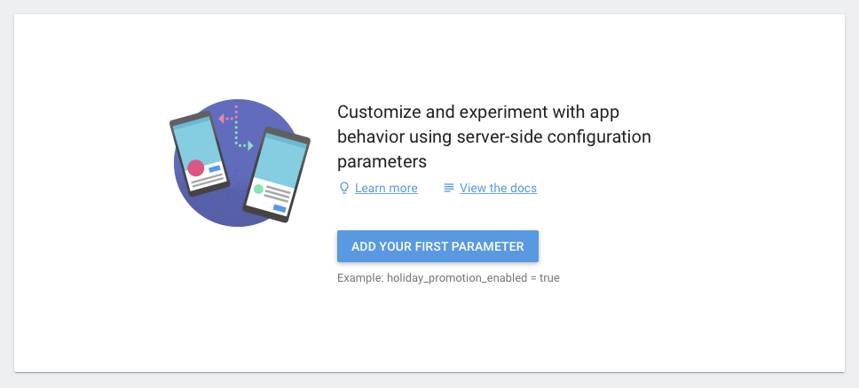
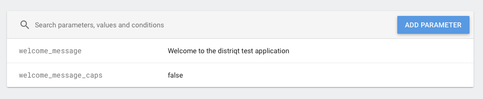

## Set Initial Values

It's helpful if you setup some initial values in the console to get started.

1. In the [Firebase console](https://console.firebase.google.com/), open your project.
2. Select **Remote Config** from the menu to view the Remote Config dashboard.
3. On first visit you should see the following screen:

4. Click "Add your first parameter" 
5. Define parameters with the same names as the parameters that you defined in your app. For each parameter, you can set a default value (which will eventually override the corresponding in-app default value), and you can also set conditional values. To learn more, see [Remote Config Parameters and Conditions](https://firebase.google.com/docs/remote-config/parameters).

For example:

Getting some initial values into the system will help you to identify connection issues early.

