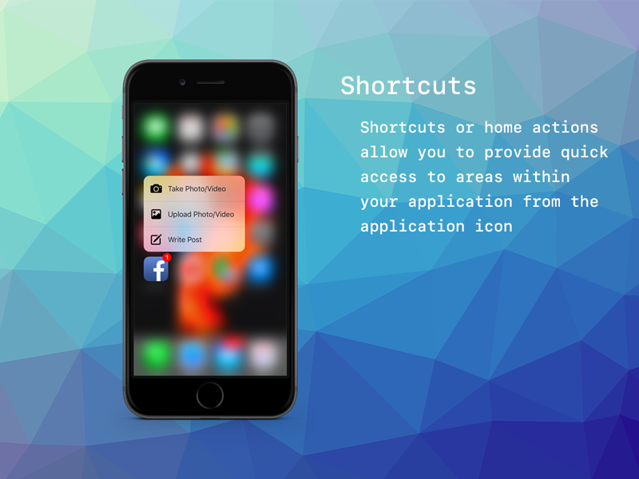
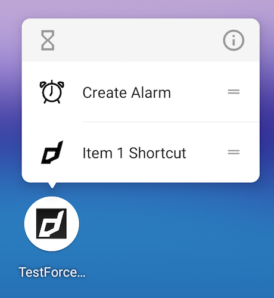
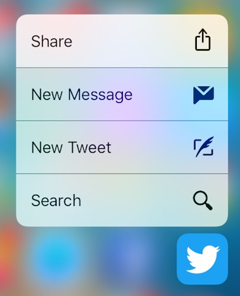

## Application Shortcuts

Application Shortcuts are additional options presented to the user when they "Force Touch" (iOS) or long press (Android) your
application icon.

Shortcuts deliver access to specific content to your users by helping them quickly access parts of your app.

| Android                           | iOS                           |
| --------------------------------- | ----------------------------- |
|  |  |

How you deliver content with shortcuts depends on your use case and whether the shortcut's context is app-driven or user-driven.

These shortcuts can be added **dynamically** using code or **statically**.

Static shortcuts are currently only supported on iOS. You use the info additions section in your application descriptor to add static shortcuts.

This functionality is provided through the `ApplicationShortcuts` interface accessed by `ForceTouch.service.shortcuts`.

### Limits

Generally, a maximum of 4 shortcuts are supported, and static items take precedence over
dynamically added items. As such, if you use 2 static shortcuts in your descriptor,
you can only add 2 additional dynamic shortcuts to your app.

## Dynamic Shortcuts

You can add shortcut items programmatically in your application, these are called _dynamic shortcuts_.

To do this you construct an instance of an `ApplicationShortcut` and then call `addDynamicShortcut()` with this item
as a parameter.

For example:

```actionscript
var shortcut:ApplicationShortcut = new ApplicationShortcut()
		.setIdentifier( "com.distriqt.test.item1" )
		.setTitle( "Item 1" );

ForceTouch.service.shortcuts.addDynamicShortcut( shortcut );
```

The minimum amount of data on a shortcut is an identifier, and a title, but we also suggest setting an icon.

A shortcut has the following pieces of information:

- `identifier`: This is a unique identifier for the shortcut
- `title`: Main title text for the shortcut item
- `subtitle`: Subtitle text for the shortcut item (optional)
- `icon`: The icon type - built-in iOS system icons (optional)
- `iconBitmap`: Bitmap data to be used to construct an icon (Android) (optional)
- `userInfo`: Custom data to be attached to the shortcut item and returned in events (optional)

> Note: Your `identifier` must be unique. If a shortcut with the same `identifier` already exists then the `addDynamicShortcut()` function will return `false` and the shortcut will not be added. You should decide if you need to remove the shortcut and update it.
>
> For example if you always want to update a shortcut:
>
> ```actionscript
> var success:Boolean = ForceTouch.service.shortcuts.addDynamicShortcut( shortcut );
> if (!success)
> {
> 	ForceTouch.service.shortcuts.removeDynamicShortcut( shortcut.identifier );
> 	ForceTouch.service.shortcuts.addDynamicShortcut( shortcut );
> }
> ```

### Icons

Icons are handled differently on iOS and Android. They are optional but highly recommended!

On iOS you must select one of the predefined iOS system icons from the `ShortcutIconType` class.

You set the icon using the `setIcon()` function and specifying the type, eg:

```actionscript
var shortcut:ApplicationShortcut = new ApplicationShortcut()
		.setIdentifier( "com.distriqt.test.item1" )
		.setTitle( "Item 1" )

		.setIcon( ShortcutIconType.Alarm );
```

On Android, you provide `BitmapData` representing your icon to display, eg using an embedded asset:

```actionscript
[Embed(source="alarm_clock.png")]
public var AlarmIcon:Class;

var alarmIcon:Bitmap = new AlarmIcon() as Bitmap;

var shortcut:ApplicationShortcut = new ApplicationShortcut()
		.setIdentifier( "com.distriqt.test.item1" )
		.setTitle( "Item 1" )

		.setIconBitmap( alarmIcon.bitmapData );
```

### Removing Dynamic Shortcuts

To remove a dynamic shortcut simply call `removeDynamicShortcut()` with the `identifier` of the item to remove.

For example, to remove the previous example:

```actionscript
ForceTouch.service.shortcuts.removeDynamicShortcut( "com.distriqt.test.item1" );
```

## Events

To listen for shortcut events you must add the `SHORTCUT_SELECTED` event listener to the `shortcuts` interface as below:

```actionscript
ForceTouch.service.shortcuts.addEventListener(
	ApplicationShortcutEvent.SHORTCUT_SELECTED,
	shortcutSelectedHandler
);
```

When your shortcut is selected your handler will be triggered and you will receive the information associated with the selected shortcut. The event `item` property will contain an `ApplicationShortcut` instance where the `identifier` and `userInfo` are valid (other fields will be invalid, i.e. title/subtitle/icons).

If your application is running in the background, it will be brought to the foreground.

```actionscript
function shortcutSelectedHandler( event:ApplicationShortcutEvent ):void
{
	trace( "Shortcut selected: " + event.item.identifier );
	// event.item.userInfo is an object which contains any custom data.
}
```

If your application wasn't running, it will be launched and brought to the foreground.

This event will be dispatched after the first time you call `addEventListener()` for the `SHORTCUT_SELECTED` event, so you should be prepared to handle this event as soon as you add the listener.

## iOS

### Adding Static Shortcuts

The ForceTouch ANE supports static shortcut items, which can be added directly to your app descriptor.
If included, these items are always present in the shortcut menu for your app.

To add static shortcuts you must modify your application descriptor and add the details
of your short cuts to the iPhone Info Additions.

These additions go into your application descriptor inside the iPhone / InfoAdditions node:

```xml
<iPhone>
	<InfoAdditions><![CDATA[
		<!-- HERE -->
	]]></InfoAdditions>
</iPhone>
```

This is an example of how to add static shortcut items in your descriptor:

```xml
<key>UIApplicationShortcutItems</key>
<array>
	<dict>
		<key>UIApplicationShortcutItemTitle</key>
		<string>Static Shortcut 1</string>
		<key>UIApplicationShortcutItemType</key>
		<string>com.distriqt.test.static_shortcut_1</string>
		<key>UIApplicationShortcutItemIconFile</key>
		<string>open-favorites</string>
		<key>UIApplicationShortcutItemUserInfo</key>
		<dict>
			<key>key1</key>
			<string>value1</string>
		</dict>
	</dict>
	<dict>
		<key>UIApplicationShortcutItemTitle</key>
		<string>Static Shortcut 2</string>
		<key>UIApplicationShortcutItemType</key>
		<string>com.distriqt.test.static_shortcut_2</string>
		<key>UIApplicationShortcutItemIconType</key>
		<string>UIApplicationShortcutIconTypeCompose</string>
		<key>UIApplicationShortcutItemUserInfo</key>
		<dict>
			<key>key2</key>
			<string>value2</string>
		</dict>
	</dict>
</array>
```
