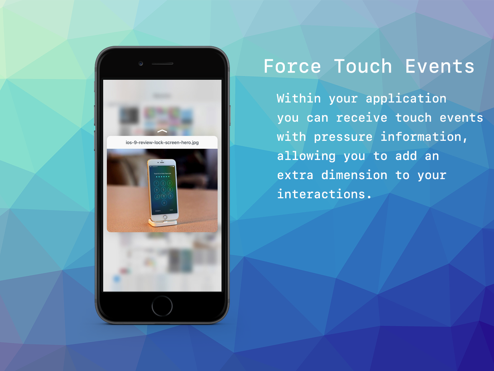

## Listening for Events


```actionscript
// Enable listeners for the force touch events
ForceTouch.service.addEventListener( ForceTouchEvent.MAX_PRESS, touchMaxPressHandler );
ForceTouch.service.addEventListener( ForceTouchEvent.PRESS, touchPressHandler );
ForceTouch.service.addEventListener( ForceTouchEvent.ENDED, touchEndHandler );
ForceTouch.service.enableForceTouch();
```


```actionscript
private function touchPressHandler( event:ForceTouchEvent ):void
{
	trace("X position: " + event.x);
	trace("Y position: " + event.y);
	trace("Pressure: " + event.pressure);
}
	
	
private function touchMaxPressHandler( event:ForceTouchEvent ):void
{
	trace("Max force touch registered!");
}


private function touchEndHandler( event:ForceTouchEvent ):void
{
	trace("Force touch ended");
}
```
