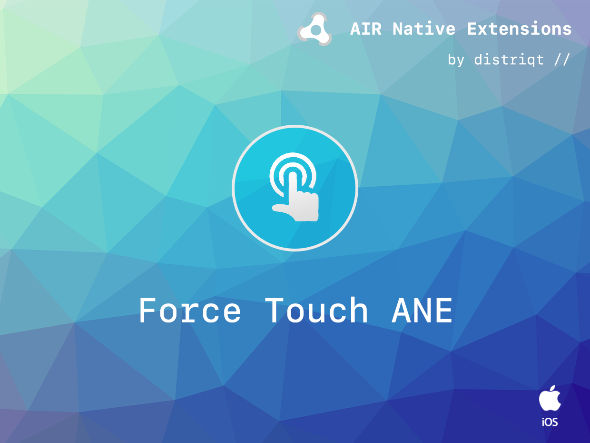
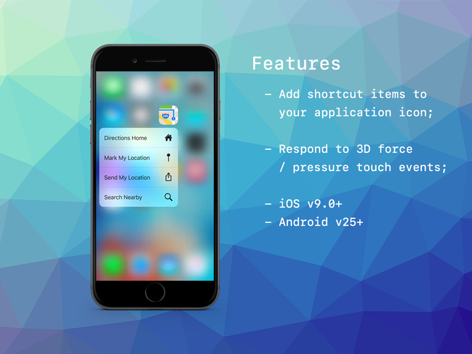

# Force Touch

The [Force Touch](https://airnativeextensions.com/extension/com.distriqt.ForceTouch) 
extension gives access to pressure events and application shortcuts for Android 25+ and iOS 9+ "3D touch" enabled devices.

The simple API allows you to quickly integrate pressure events and application shortcuts in your AIR application in just a few lines of code. 
We provide complete guides and asdocs to get you up and running quickly and easily.


### Features

- 3D Touch: Detect pressure-sensitive touch events with stage position and force percentage
- Shortcut Items: Utilise static and dynamic application shortcuts for your application, and respond to shortcut events in your app
- Single API interface - your code works across supported platforms with no modifications
- Sample project code and ASDocs reference


As with all our extensions you get access to a year of support and updates as we are 
continually improving and updating the extensions for OS updates and feature requests.


## Documentation

The [Wiki](https://github.com/distriqt/ANE-ForceTouch/wiki) forms the best source of detailed documentation for the extension along with the [asdocs](https://docs.airnativeextensions.com/asdocs/forcetouch). 

Quick Example: 

```actionscript
var shortcut:ApplicationShortcut = new ApplicationShortcut()
        .setIdentifier( "com.distriqt.test.news" )
        .setTitle( "News" );

ForceTouch.service.shortcuts.addDynamicShortcut( shortcut );

ForceTouch.service.shortcuts.addEventListener(
        ApplicationShortcutEvent.SHORTCUT_SELECTED,
        shortcutSelectedHandler
);


function shortcutSelectedHandler( event:ApplicationShortcutEvent ):void
{
    // process shortcut
}
```

More information here: 

[com.distriqt.ForceTouch](https://airnativeextensions.com/extension/com.distriqt.ForceTouch)


## License

You can purchase a license for using this extension:

[airnativeextensions.com](https://airnativeextensions.com/)

distriqt retains all copyright.


